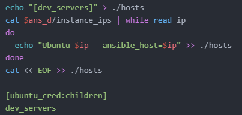

# CI/CD pipeline for Java app

## Tasks  
1. Build artifact  
2. Infrastructure creation and configuration for:  
  - Development (Dev) and Test environments
  - Production (Prod) environment
3. Delivery to dev/test environment
4. Deploy to production

## Technology Stack  
1. Jenkins – tasks automation and management tool
2. Terraform – infrastructure provisioning
3. Ansible – infrastructure configuration
4. Docker – services containerization on Dev/Test

## Integration
  
Jenkins Build Agent was moved from Cloud to local PC for better productivity (than on t2.micro) and save costs.  

Build_Artifact_Job  steps:  
1. Poll changed files from GitHub  
2. Creates a Docker container with MySQL DB for testing  
3. Builds jar with Maven Integration plugin  
4. Destroys Docker  container  
5. Packages an artifact to be sent to other jobs  
6. Triggers Dev_Delivery_Job  

Default DB in Spring Petclinic – h2. If switch it to external BD usage, part of integration tests failed because of database can not be found:  
  
Solution – to use Docker and run a container with MySQL DB in it:  
  

##  Infrastructure Design and Jobs Required List  
  
  

### Jobs relations scheme
  

## Dev Environment Creation  

### Dev_Provisioning_Job steps:  
1. Creates a Terraform file  
2. Launches terraform apply  
3. Finds in Terraform ouputs IP-adresses of all created instances and saves list to instance_ips file to be passed to configuring with Ansible job  
4. Saves terraform.tfstate file in environment repo  
5. Triggers Dev_Configuring_job  
https://github.com/YuriyPelykh/DevOps_online_Kyiv_2021Q4/blob/master/final_task/shell_srcipts/dev_provisioning_job.sh
  

### Dev_Configuring_Job  steps:  
1. Reads instance_ips  file created by Terraform  
2. Makes hosts file for Ansible  
3. Makes ubuntu_cred and playbook.yml, with tasks Docker and doker-compose to be installed.  
  
  
4. Starts Ansible playbook to apply configuration on all instances  
  
5. Triggers Dev_Delivery_Job  
https://github.com/YuriyPelykh/DevOps_online_Kyiv_2021Q4/blob/master/final_task/shell_srcipts/dev_configuring_job.sh

## Deploy to Dev  
### Dev_Delivery_Job  steps:  
1. Checks if infrastructure exists  
2. Copys artifact fom Build_Artifact_Job project via Copy Artifact plugin.  
3. Makes Dockerfile with artifarc jar-file specified in it  
4. Makes docker-compose.yml file.  
5. Sends docker config files and artifact to all created instances  
6. Sends on instances a command to build an image and to launch the containers (app and db)  
  

Deploy to Dev Result:  
  

### Pipeline in action:  
  

## Prod Environment Creation  

### Prod Architecture  
  

Entities need to be created created:  
- aws_vpc  
- aws_subnet  
- aws_internet_gateway  
- aws_route_table  
- aws_route_table_association  
- aws_vpc  
- aws_db_instance  
- aws_db_subnet_group  

### Prod__Provisioning_Job:  
1. Takes already wrote config .tf – files from repo  
2. Creates instances with Terraform  
3. Creates instance_ips file for Ansible  
4. Saves terraform.tfstate file in environment repo  
5. Triggers Prod_Configuring_Job  

### Prod__Configuring_Job:  
1. Reads instance_ips  file created by Terraform  
2. Configures instances with Ansible (java runtime environment installation)  
3. Triggers job for application deploy  

Scripts: https://github.com/YuriyPelykh/DevOps_online_Kyiv_2021Q4/tree/master/final_task/prod_provision_terraform

## Deploy to Production  

### Prod_Deploy_Job:  
1. Reads instance_ips  file created by Terraform  
2. Sends .jar file to each instance  
3. Makes export to environment variables of MySQL DB address, got from Terraform’s outputs earlier.  
4. Starts Java application on remote instsnce(s)  

  
  
  

## Conclusions  
In final project an automated conveyor of new code continuous integration and deploy was configured on a basis of Jenkins.  
Got acquaintance with main CI/CD tools and technologies, their  configuration and usage.  
Were learned a principles of automated cloud infrastructure creation with Terraform, its’ configuration management with Ansible and got a practical experience of work with this tools.  

Sources:   
1. Terraform documentation:  
https://registry.terraform.io/providers/hashicorp/aws/latest/docs/  
2. AWS CLI Installation:  
https://docs.aws.amazon.com/cli/latest/userguide/getting-started-install.html  
3. Spring-petclinic test fail with profile MySQL solution:  
https://github.com/spring-projects/spring-petclinic/issues/824  
