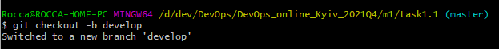
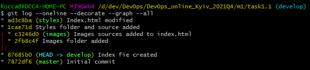
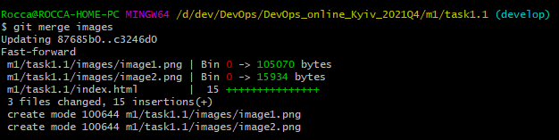
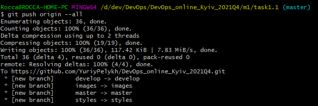
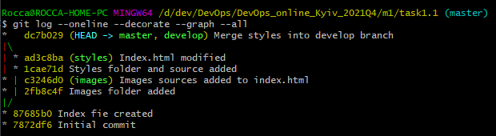

# Task 1.1

Під час виконання **завдання 1.1** було вивчено поняття та основні принципи роботи систем контролю версій, зокрема [СКВ Git](https://git-scm.com/book/ru/v2/%D0%92%D0%B2%D0%B5%D0%B4%D0%B5%D0%BD%D0%B8%D0%B5-%D0%9E-%D1%81%D0%B8%D1%81%D1%82%D0%B5%D0%BC%D0%B5-%D0%BA%D0%BE%D0%BD%D1%82%D1%80%D0%BE%D0%BB%D1%8F-%D0%B2%D0%B5%D1%80%D1%81%D0%B8%D0%B9). Здобуто практичні навички:
  * Встановленя **Git**.
  * Роботи із командним рядком **Git**.
  * Базових налаштувань **Git**.
  * Створення репозиторіїв.
  * Роботи з гілками:
    1. Створення гілок (гілка develop):
    
    1. Галуження - гілка develop була "розділена" на дві: images та styles, в яких велася робота та зміни файлів одночасно:
    
    1. Злиття гілок - об'єднання напрацювань із двох незалежних гілок images та styles в гілку develop:
    
    3. Вирішення конфліктів злиття, які виникають в разі розбіжності файлів, що змінювалися у паралельних гілках:
    
  * Роботи з віддаленими репозиторіями (**Github**):
  
  * Роботи з інструментами перегляду історії та аналізу в **Git** (log, reflog, diff):
  
  * Роботи з мовою розмітки **Markdown**.
