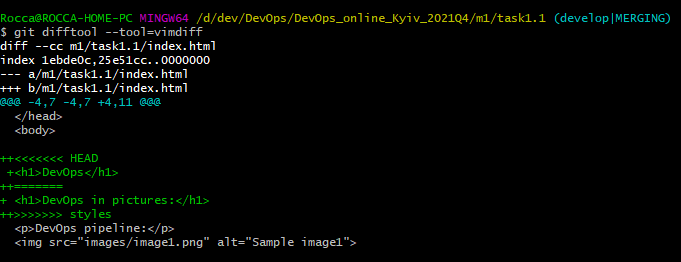

# Task 1.1

During the execution of **task 1.1** the concepts and basic principles of operation of version control systems were studied, in particular [VCS Git](https://git-scm.com/book/ru/v2/%D0%92%D0%B2%D0%B5%D0%B4%D0%B5%D0%BD%D0%B8%D0%B5-%D0%9E-%D1%81%D0%B8%D1%81%D1%82%D0%B5%D0%BC%D0%B5-%D0%BA%D0%BE%D0%BD%D1%82%D1%80%D0%BE%D0%BB%D1%8F-%D0%B2%D0%B5%D1%80%D1%81%D0%B8%D0%B9). Acquired practical skills of:  
  1. **Git** іnstallation.
  2. Work with the **Git** command line.
  3. **Git** basic settings.
  4. Repositories creating.
  5. Work with branches:
    * Creating branches (branch "develop"):  
    
    * Branching - the "develop" branch was divided into two: "images" and "styles", in which work was carried out and files modifications took place:  
    
    * Merging branches - merge developments from two independent branches "images" and "styles" into a "develop" branch:  
    
    * Resolution of merge conflicts that occur in case of discrepancy of files with the same name, which were modified in parallel branches:  
    
  6. Work with remote repositories (**Github**):  
  
  7. Work with tools for viewing history and analysis in **Git** (log, reflog, diff):  
  
  8. Work with **Markdown** markup language.

  DevOps - is a bit from each of the stages of the software development cycle, a set of practices that allow all its processes to be  more flexible and efficient.
