# Task 10.1 Terraform  

## 1. Creation of AWS infrastructure with terraform:  
1. Terraform installation:  
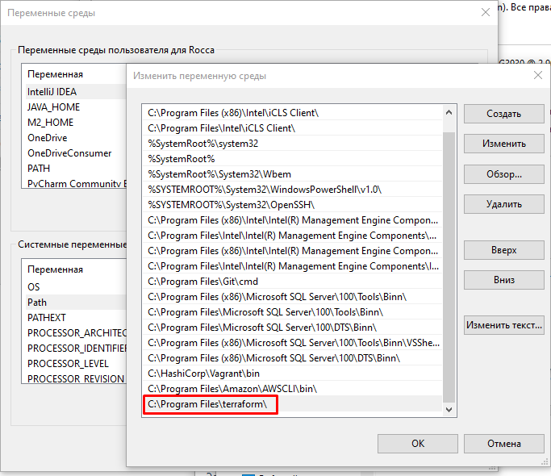  
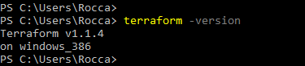  
2. **.tf** configuration file creation:  
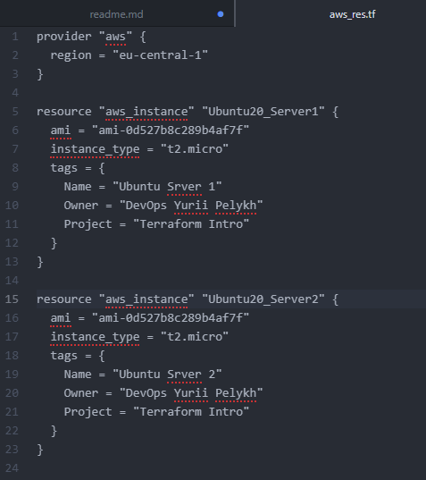  
3. Terraform installation (**init**):  
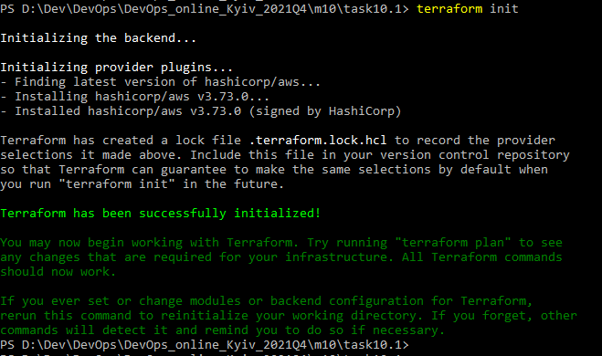  
4. Terraform **plan**:  
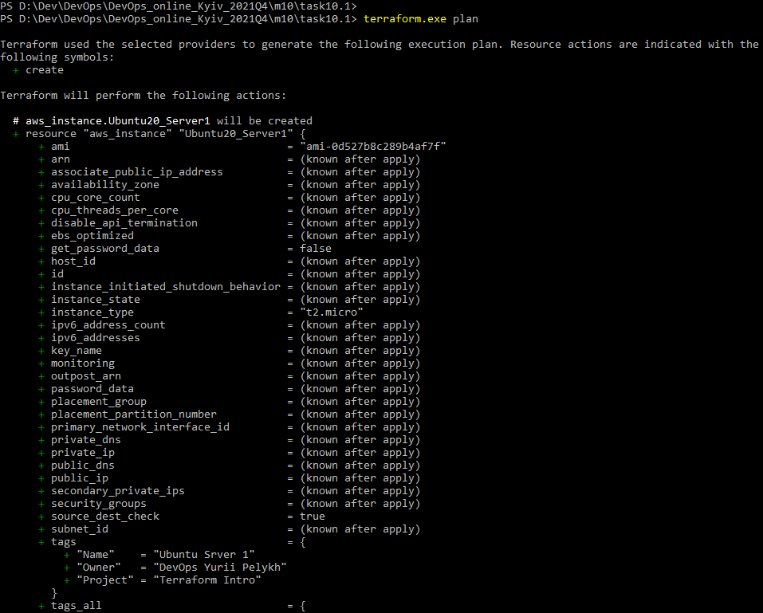  
5. Terraform **apply**:  
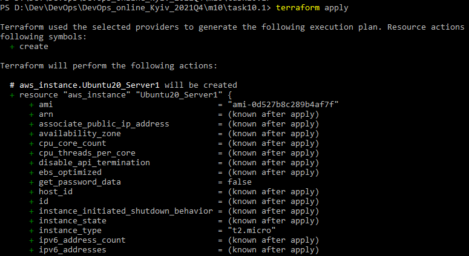  
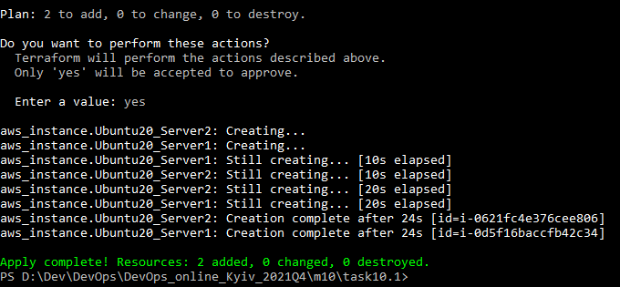  
5. Checking result:  
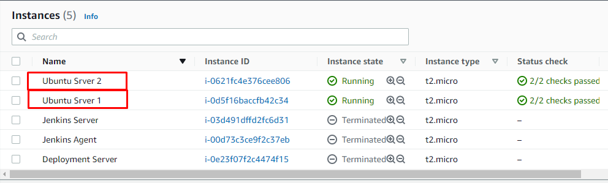  
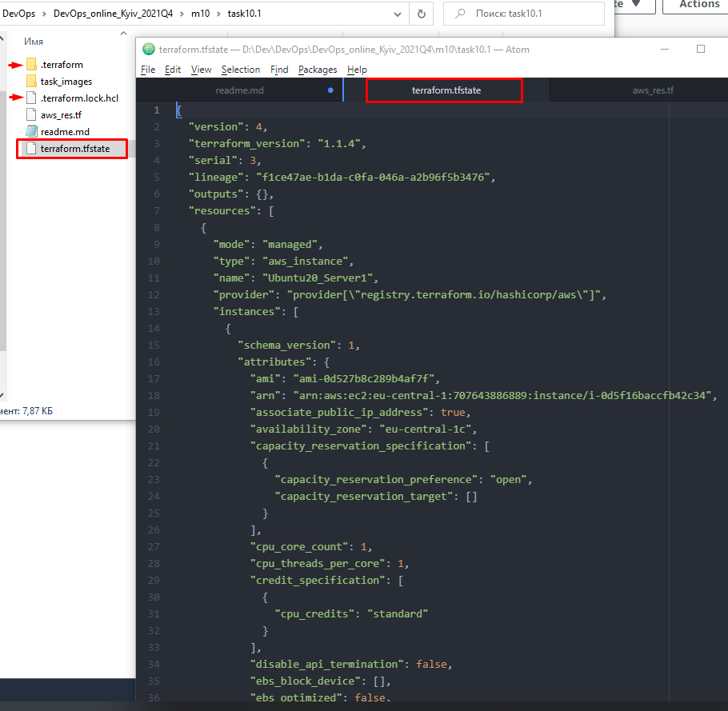  
6. Terraform **destroy**:  
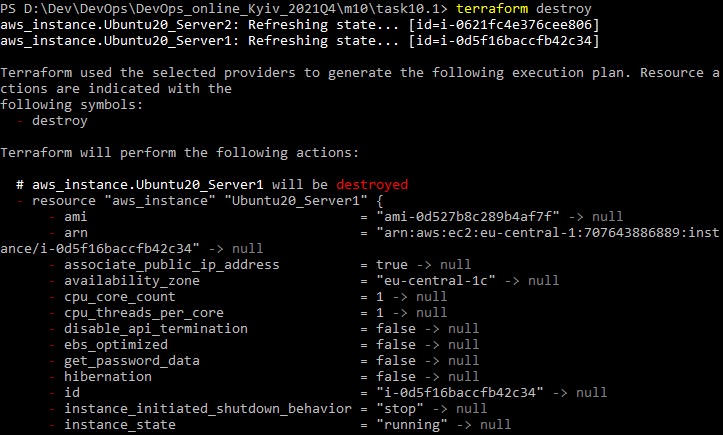  
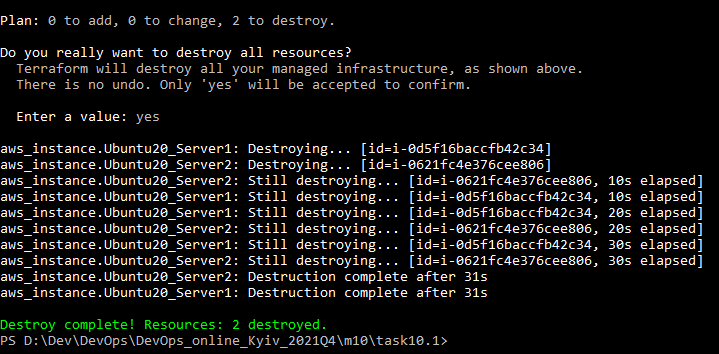  

9.
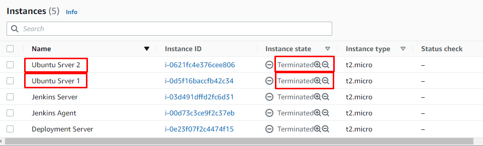  
  
