# Task 11.1 Docker

## 1. Docker practice basics:  
1. Installation made as described in https://docs.docker.com/engine/install/ubuntu/  
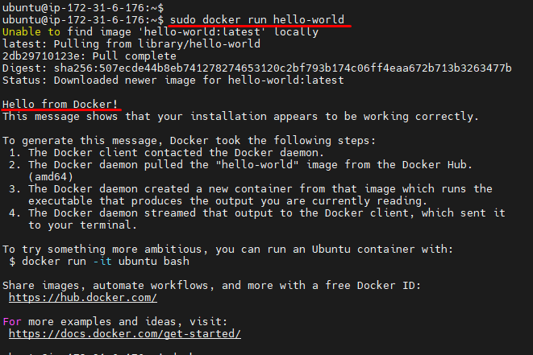  
2. Allowing non privileged users to run Docker commands withput sudo:  
**sudo usermod -aG docker ubuntu**
3. Creation of **Dockerfile**:  
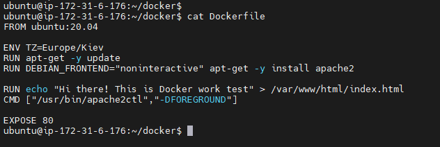  
4. Docker build image:  
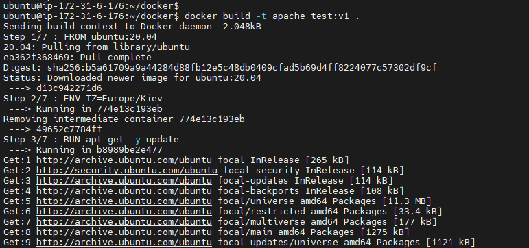  
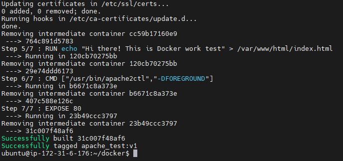  
5. Run container:   
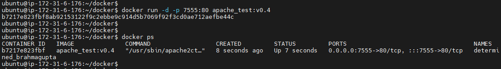  
5. Checking result:  
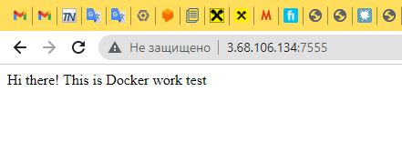  

## 2. Webapps with Docker, Docker Hub:  
1. Application for random cats pictures generation:  
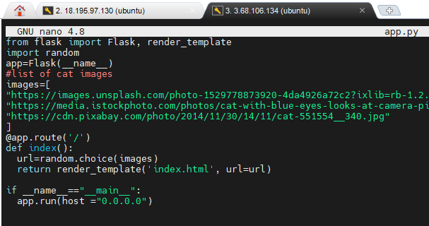  
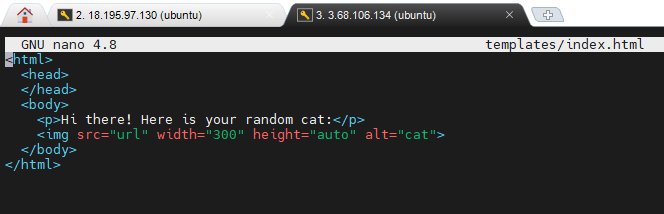  
  
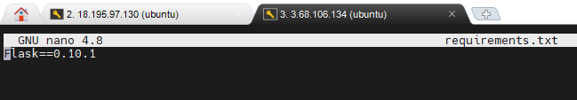  
2. Docker build:  
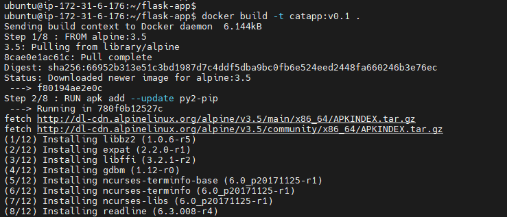  
3. Docker run:  
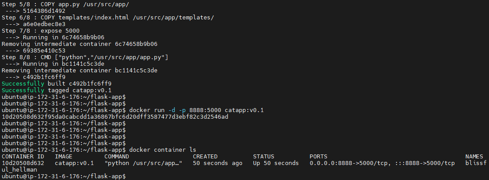  
4. Result:  
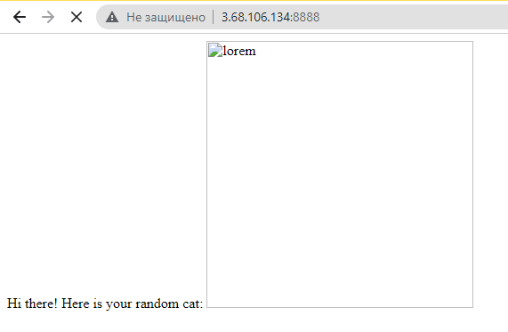  
5. Push of created image to Docker Hub:  
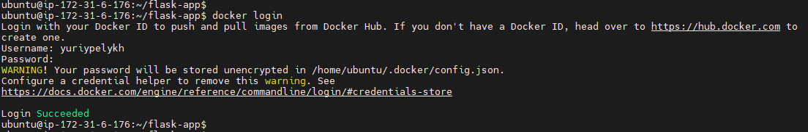  
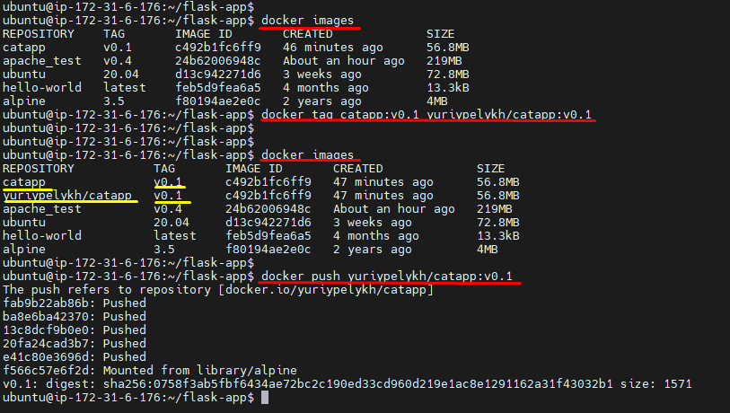  
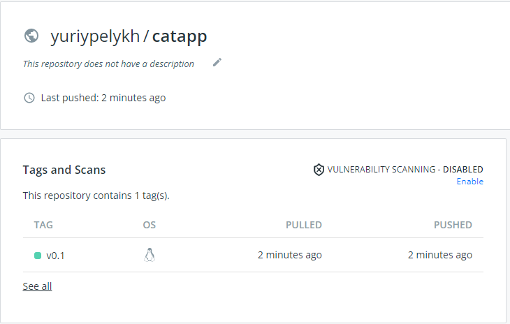  
