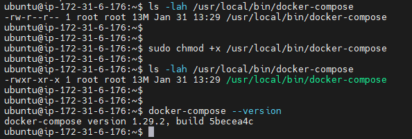
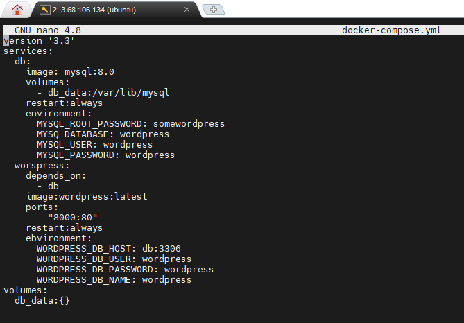
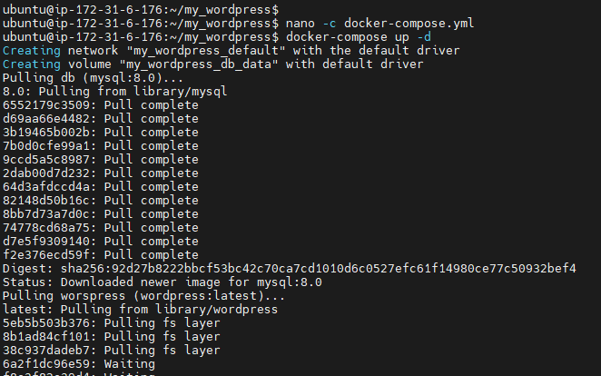
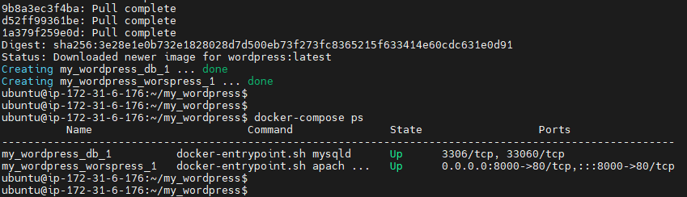
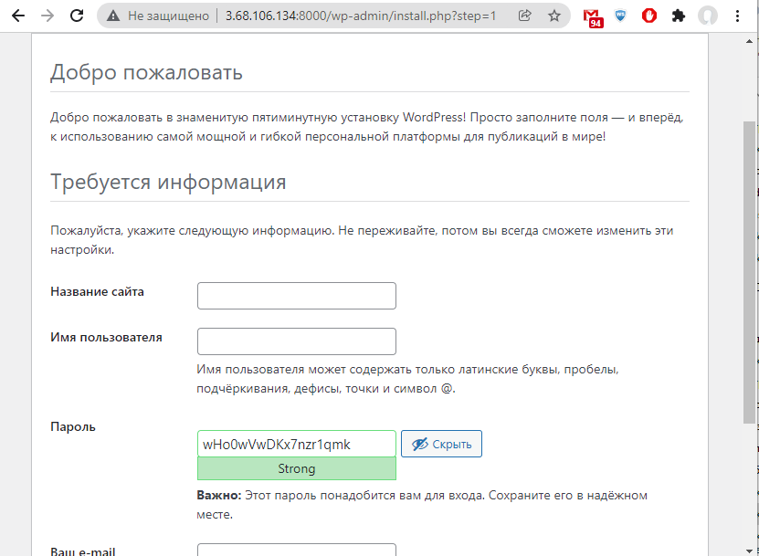

# Task 11.1 Docker

## 1. Docker practice basics:  
1. Installation made as described in https://docs.docker.com/engine/install/ubuntu/  
  
2. Allowing non privileged users to run Docker commands withput sudo:  
**sudo usermod -aG docker ubuntu**
3. Creation of **Dockerfile**:  
  
4. Docker build image:  
  
  
5. Run container:   
  
5. Checking result:  
  

## 2. Webapps with Docker, Docker Hub:  
1. Application for random cats pictures generation:  
  
  
  
  
2. Docker build:  
  
3. Docker run:  
  
4. Result:  
  
5. Push of created image to Docker Hub:  
  
  
  

## 3. Docker Compose
1. Docker compose installed:  
  
2. Craeting of **docker-compose.yml** file:  
  
3. Containers launched:  
  
  
4. WP admin page is working:  
  
5. **Note:** Syntax mistake in **docker-compose.yml** caused the WP to DB connection error, but after it was corrected, error still anyway. Solution: **docker volumes prune** also need to be performed besides **docker-compose down/up** commands (https://github.com/docker-library/mysql/issues/180#issuecomment-541244937).  

Frequently used Docker commands:
**$ docker ps [-a]**                        # list
**$ docker stop $(docker ps -a -q)**        # stop all containers [you need stop before delete]
**$ docker rm 0fd99ee0cb61**                # remove a single container
**$ docker images -a**                      # list
**$ docker rmi $(docker images -a -q)**     # remove all images

**$ docker search tomcat**
**$ docker pull tomcat**
**$ docker search nginx**
**$ docker pull nginx**
**$ docker run -it -p 8889:8080 tomcat**
**$ docker run -it -p 8888:80 nginx**
**$ docker run -d -p 8890:80 nginx**
