# Task 2.1  
## Частина І. Гіпервізори:  
### 1. Найбільш популярні гіпервізори для віртуалізації інфраструктури:  
  - VMvare ESX Server  
  - Microsoft Hyper-V  
  - Red Hat KVM  
  - Citrix Xen  

### 2. Основні відмінності найбільш популярних гіпервізорів:  
#### VMware:  
  - Гіпервізор типу 1 (bare-metal, native).  
  - Fault Tolerance - непотрібне перезавантаження ВМ при падінні хоста, переключення на інший відбувається миттєво і непомітно для користувача.  
  - Distributed Resource Scheduler (DRS) і Storage DRS (SDRS) — балансування навантаження на CPU і RAM в автоматичному режимі, в т.ч предиктивно (на відміну від System Scheduler від Red Hat).  
  - AppDefense - вивчення нормальної поведінки ОС і при відхиленні виконуються певні заходи для захисту ВМ.  

#### Hyper-V:  
  - Гіпервізор гібридного типу 1+ (hybrid).  
  - Безкоштовний.  
  - Не підтримує прокидання апаратних USB-портів.  
  - Не вміє на льоиу додавати CPU.  
  - Підтримується не так багато ОС.  
  - Дозволяє не лише збільшувати, а й зменшувати об'єм диска.  
  - VM-GenerationID - корисно при складних схемах Active Directory з багатьма КД - легше відкочуватись.  

#### RedHat KVM:  
  - Гіпервізор типу 2 (hosted).  
  - За промовчанням під Лінуксові ВМ.  
  - Невибагливість до апаратних ресурсів.  
  - Відсутність розвинених засобів керування.  
  - Менш стабільна робота для задач з потужним і інтенсивним I/O.  

#### Citrix Xen:  
  - Гіпервізор гібридного типу 1+ (hybrid).  
  - Потужний в віртуалізації робочих місць із комп. моделювання Computer-Aided Design (CAD) и Computer-Aided Manufacture (CAM) через можливості:  
    - GPU Pass-through - прокидання топових відях в гостьові ВМ.  
    - GPU Virtualization.  
    - vGPU Live Migration — дозволяє ВМ переміщуватися між хостами без втрати доступу до GPU.  

## Частина ІI. Робота з VirtualBox:  
### 1. Робота з VirtualBox:
  В даній частині було вивчено основи роботи з VirtualBox:  
  - Встановлення програми віртуалізації VirtualBox.  
  - Розгортання віртуальних машин (ВМ) та основного функціоналу з їх керування:  
  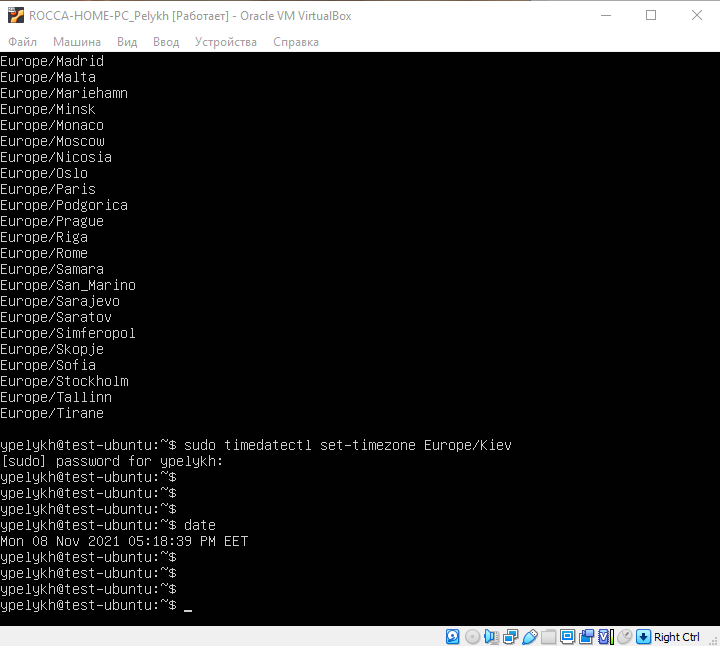  
  - Клонування ВМ, створення груп та керування груами ВМ:  
  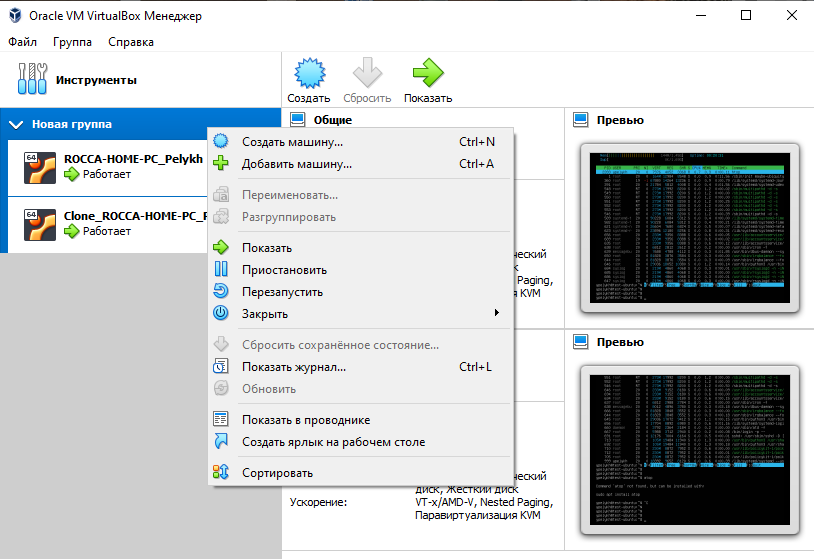  
  - Створення миттєвих знімків стану ВМ:  
  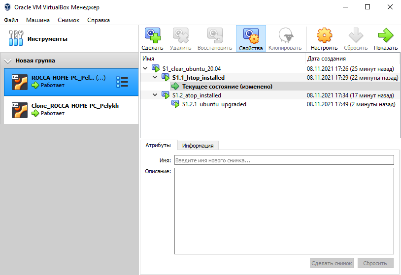  
  - Експорт ВМ у файл та імпорт із нього.
  > ! При екпорті ВМ у файл зберігається лише поточний стан машини без дерева знімків.

### 2. Конфігурація віртуальних машин  
  - Досліджено загальні параметри конфігурації ВМ.  
  - Конфігурація прокидання USB-порта із хостової системи у гостьову:  
  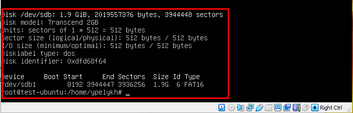
  - Налаштування спільної папки між ВМ та хостовою ОС:  
  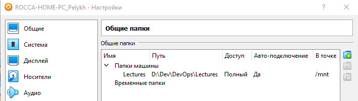  
  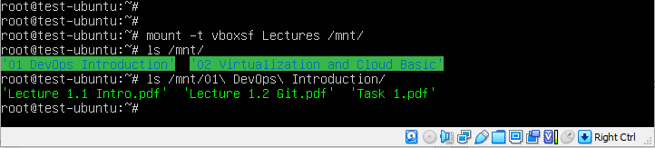  
  - Конфігурації мережного інтерфейсу на ВМ:
    - NAT - обидві ВМ мають доступ до хоста, до Інтернету, не мають зв'язку між собою.  
    - Bridge - усі бачать усіх:  
    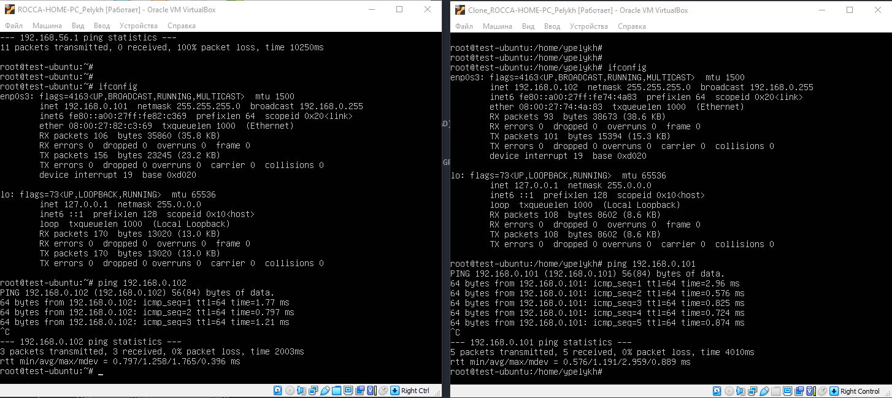  
    - Внутрішня мережа - між собою видимі лише ВМ:  
    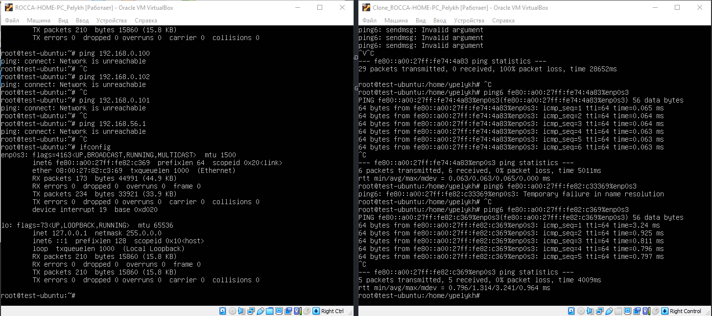  
    - Віртуальний адаптер хоста - доступ є лише з ВМ в Інтернет.  
    Загальна схема зв'язків має вигляд:  
    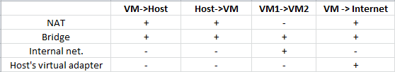  

### 3. Робота з VirtualBox через командний рядок (CLI):  
  - Ознайомлено з утилітою VBoxManage, виконанням основних команд управління ВМ через командний рядок:  
  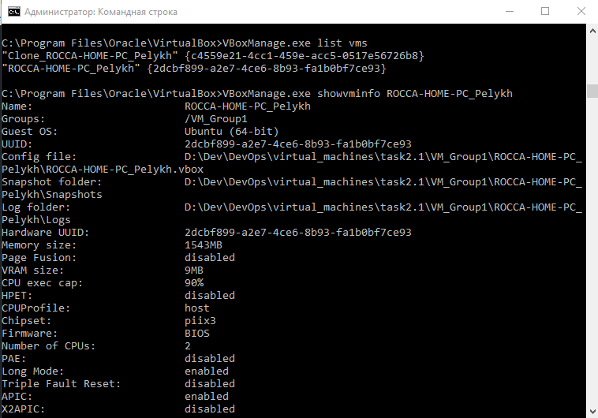  

## Частина ІII. Робота з Vagrant:  
 Здобуто практичні навички роботи з Vagrant:
  - Розгортання віртуальних машин за допомогою Vagrant із готових "боксів" (box) Vagrant:
  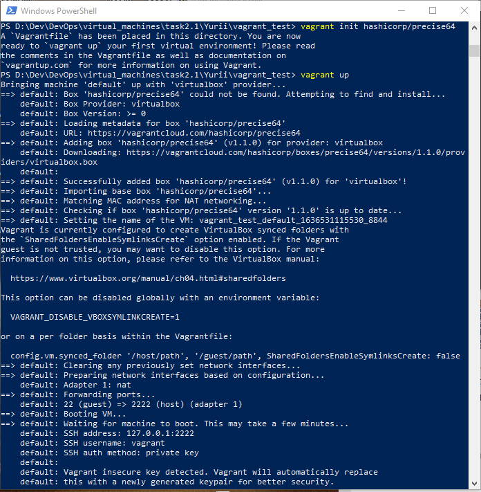  
  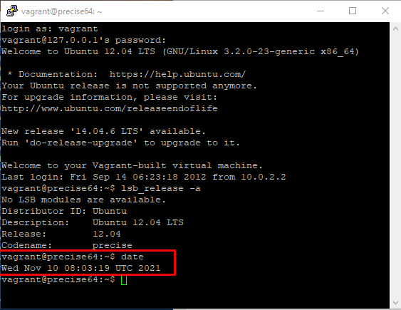  
  - Створення власних "боксів" Vagrant:  
  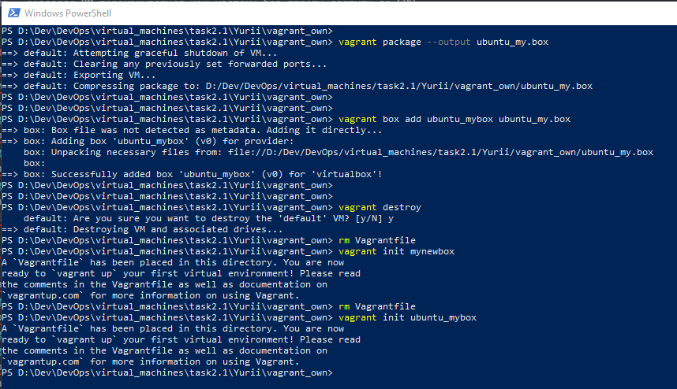  
  - Створення тестових середовищ із кількох серверів за допомогою Vagrant:  
  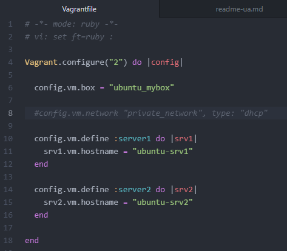  
  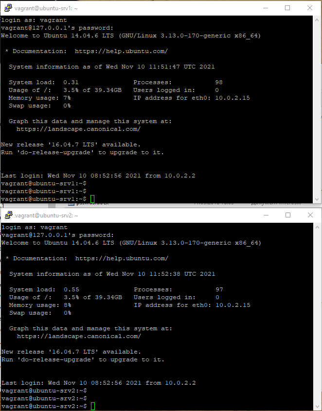  
