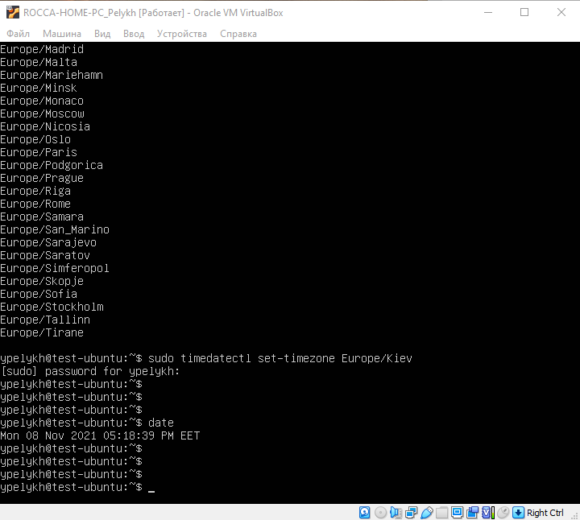
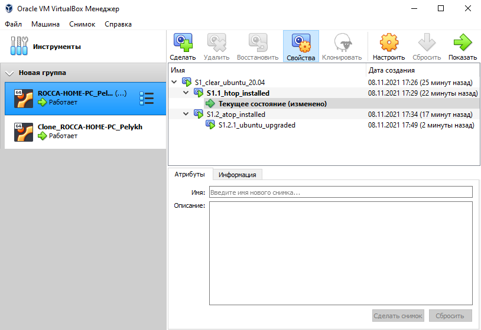
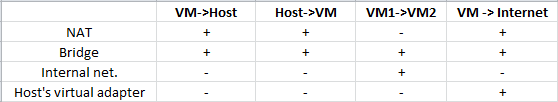
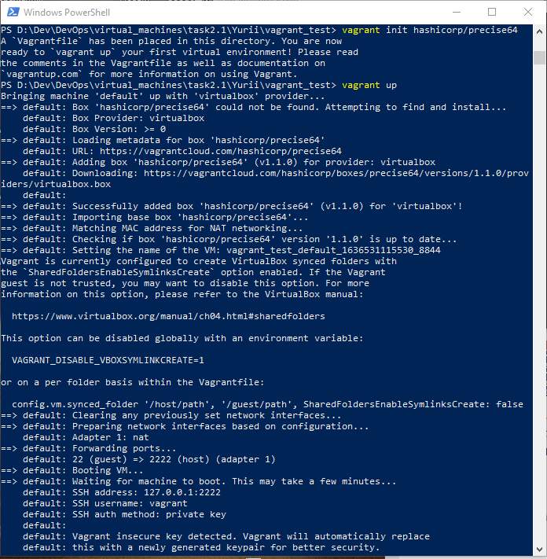
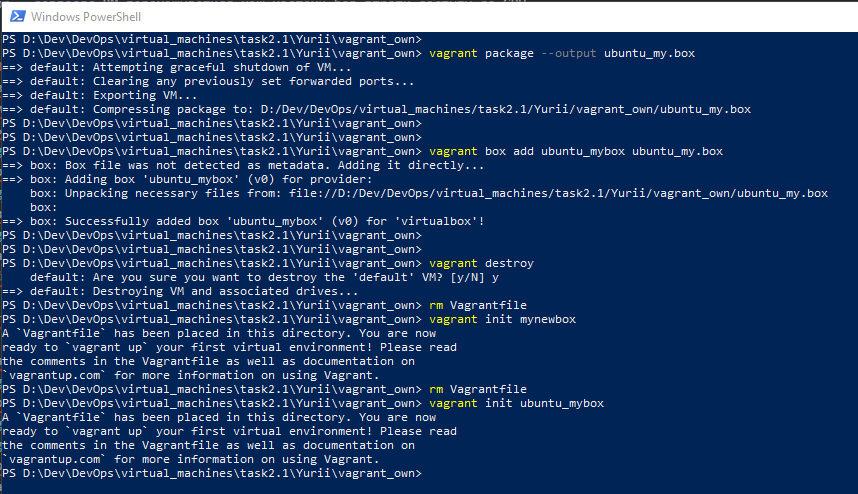
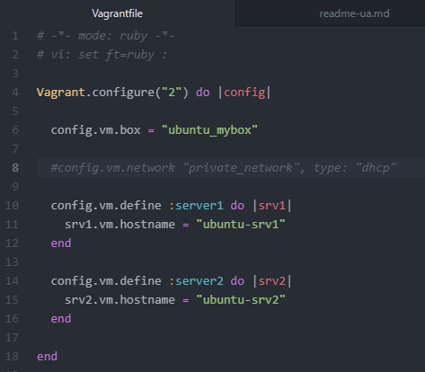
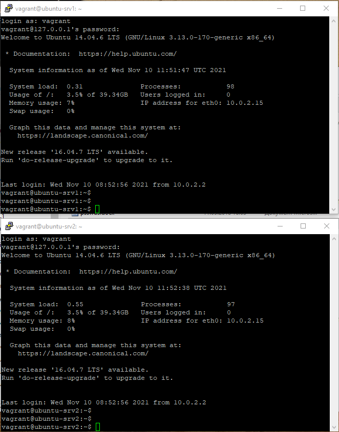

# Task 2.1
## Part I. Hypervisors:
### 1. The most popular hypervisors for infrastructure virtualization:
  - VMware ESX Server
  - Microsoft Hyper-V
  - Red Hat KVM
  - Citrix Xen

### 2. The main differences of the most popular hypervisors:
#### VMware:
  - Type 1 hypervisor (bare-metal, native).
  - Fault Tolerance - unnecessary VM reboot when the host crashes, switching to another host is instantaneous and invisible to the user.
  - Distributed Resource Scheduler (DRS) and Storage DRS (SDRS) - load balancing on CPU and RAM in automatic mode, including predictive (unlike System Scheduler from Red Hat).
  - AppDefense - learning the normal behavior of the OS and in case of deviation, certain measures are taken to protect the VM.

#### Hyper-V:
  - Type 1+ hypervisor (hybrid).
  - Free.
  - Does not support hardware USB-ports pass-through.
  - Can not add CPU on the fly.
  - Not all OS are supported.
  - Allows not only to increase, but also to reduce disk volume.
  - VM-GenerationID - useful for complex Active Directory schemes with many CDs - easier to roll out.

#### RedHat KVM:
  - Type 2 hypervisor (hosted).
  - Usually Default under Linux VM.
  - Requires little hardware resources.
  - Lack of management tools.
  - Less stable operation for tasks with powerful and intensive I/O.

#### Citrix Xen:
  - Type 1+ hypervisor (hybrid).
  - Powerful in virtualization of workstations for Computer-Aided Design (CAD) and Computer-Aided Manufacture (CAM) due to the capabilities of:
    - GPU Pass-through - top videocards pass-through to the guest OS.
    - GPU Virtualization.
    - vGPU Live Migration - allows VMs to move between hosts without losing access to the GPU.

## Part II. Working with VirtualBox:  
### 1. Working with VirtualBox:  
 In this part the basics of working with VirtualBox were learnt:  
  - Installing the VirtualBox virtualization program.  
  - Deployment of virtual machines (VM) and the main functionality for their management:  
    
  - VM cloning, group creation and VM group management:  
    
  - Creating VM snapshots:  
  
  - Export VM to file and import from it.
  >! When exporting a VM to a file, only the current state of the machine without the snapshots tree is saved.  

### 2. Configuration of virtual machines  
  - The general parameters of VM configuration were learnt.  
  - Configuration of USB-port through-path from the host system to the guest:  
    
  - Setting up a shared folder between the VM and the host OS:  
    
    
  - VM network interface configurations:    
   - NAT - both VMs have access to the host, to the Internet, have no connection with each other.  
   - Bridge - Everyone sees everyone:  
     
   - Internal network - only VMs are visible to each other:  
     
   - Virtual host adapter - access is only from the VM to the Internet.  
   The general scheme of connections is:  
     

### 3. Working with VirtualBox via the command line (CLI):  
  - Got acquainted with VBoxManage utility, execution of basic VM control commands via the command line:  
    

## Part III. Working with Vagrant:  
 Got practical skills in working with Vagrant:  
  - Deployment of virtual machines using Vagrant from ready boxes:  
    
    
  - Creating your own Vagrant boxes:  
    
  - Creating test environments from few servers using Vagrant:  
    
    
