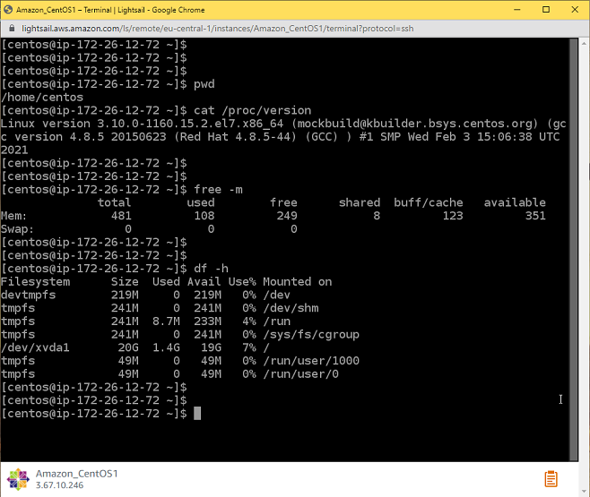
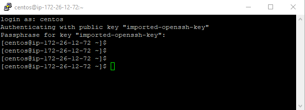
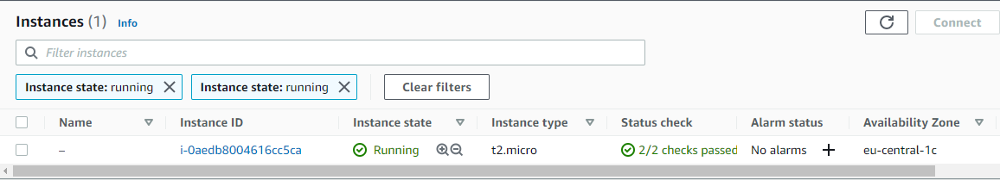
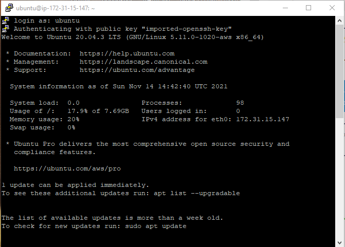

# Завдання 2.2  
 Було вивчено базові теоретичні основи та здобуто практичний досвід роботи з хмарними сервісами AWS, а саме:  
  - Створення віртуального приватного сервера (VPS) з Amazon Lightsail, можливості віддаленого підключення до нього через:  
    - Web-термінал:  
      
    - SSH-клієнт:
      
  - Розгортання серверів через AWS Management Console на основі інстансів (instance) Amazon Elastic Compute Cloud (EC2):
    
    

  > В якості операційної системи було обрано Ubuntu Server 20.04 замість рекомендованої CentOS, так як остання не надаэться для безкоштовного використання в рамках Amazon Free Tier.  

  - Збереження стану розгорнутих ВМ у вигляді знімків стану (snapshots):  
    
  - Створення інстансів збереження даних Elastic Block Store (EBS), їх додавання до існуючих EC2 та виконання необхідних налаштувань всередині ОС з метою зробити доданий EBS доступним для збереження даних:  
    
    
  - 
