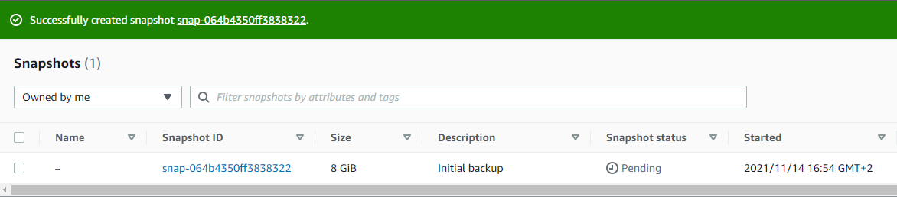
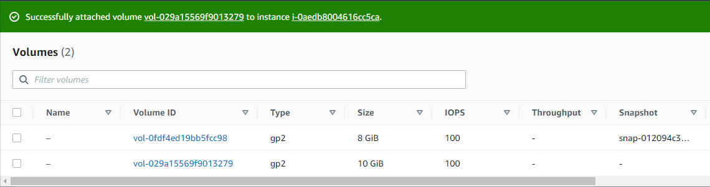
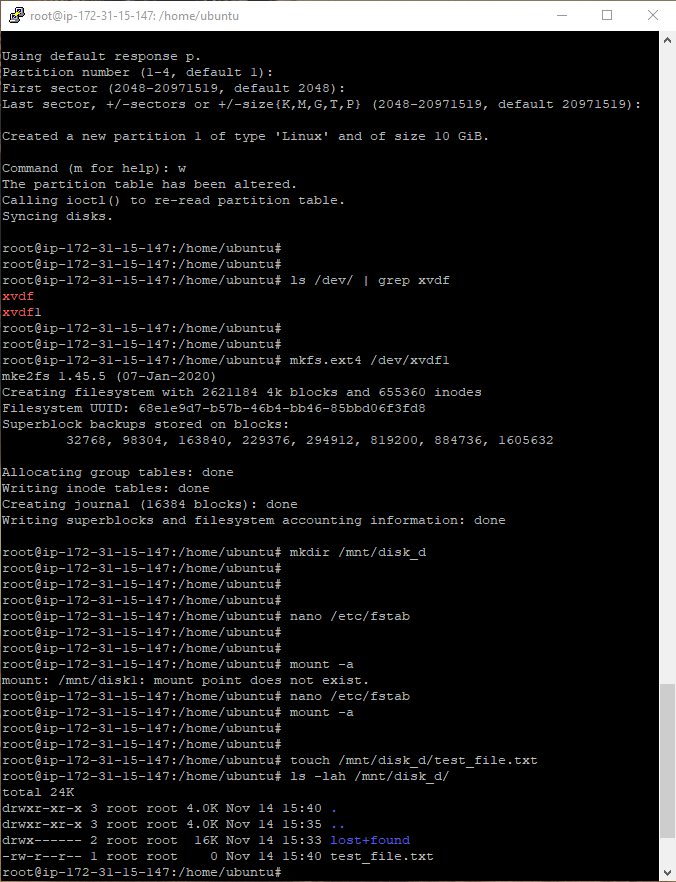
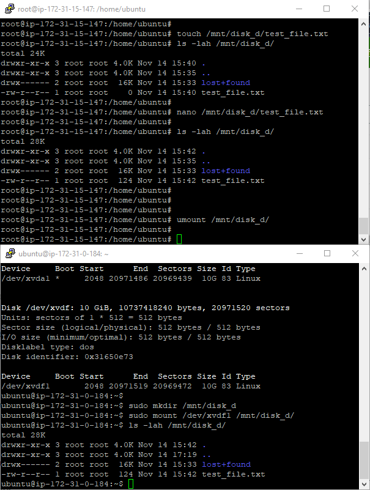
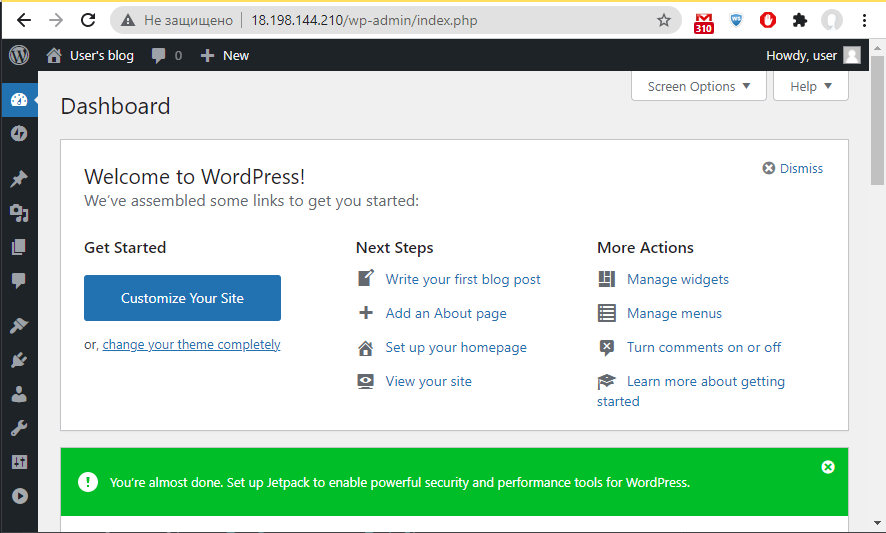
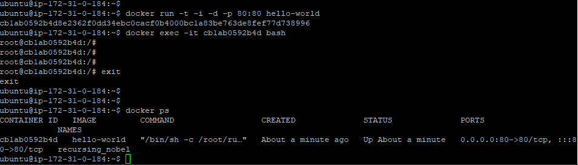
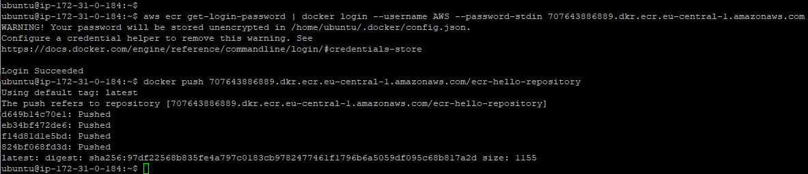
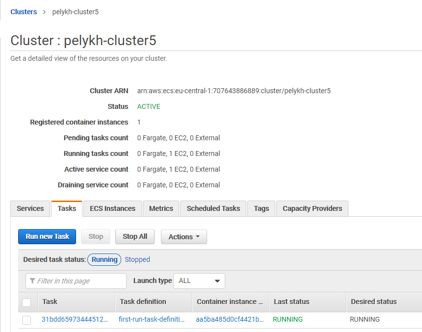

# Завдання 2.2  
 Було вивчено базові теоретичні основи та здобуто практичний досвід роботи з хмарними сервісами AWS, а саме:  
  - Створення віртуального приватного сервера (VPS) з Amazon Lightsail, можливості віддаленого підключення до нього через:  
    - Web-термінал:  
      
    - SSH-клієнт:  
      
  - Розгортання серверів через AWS Management Console на основі інстансів (instance) Amazon Elastic Compute Cloud (EC2):
    
    

  > В якості операційної системи було обрано Ubuntu Server 20.04 замість рекомендованої CentOS, так як остання не надається для безкоштовного використання в рамках Amazon Free Tier.  

  - Збереження стану ВМ у вигляді знімків (snapshots):  
    
  - Створення інстансів збереження даних Elastic Block Store (EBS), їх приєднання до існуючих EC2 та виконання необхідних налаштувань всередині ОС ВМ з метою зробити доданий EBS доступним для збереження даних:  
    
    
  - Розгортання інстансу із бекапу. Для цього:  
    - із розділу Snapshots було створено образ (image) на основі раніше зробленого знімка стану ВМ:  
      
    - запущено новий інстанс EC2 зі створеного образу:  
      
      
  - Перенесення раніше створеного диска EBS із першої ВМ на другу:  
    
    
  - Створення і конфігурування інстансу WordPress, використовуючи Amazon Lightsail, налаштування статичної IP-адреси:  
    
    
  - Створення інстансу Simple Storage Service (S3):  
    - Завантаження файлів до/із bucket через web-інтерфейс сервісу S3.  
    - Створення облікового запису AWS Identity and Access Management (IAM).  
    - Встановлення та конфігурування CLI AWS.  
    - Завантаження файлів до/із bucket через AWS CLI:  
      
  - Досліджено можливості створення власного домену і доменного імені за допомогою AWS-сервісу Route53.  
  - Робота з Docker:  
    - Встановлення Docker, створення і запуск власних образів із Dockerfile:  
    
  
  
    - Робота з Amazon Elastic Container Service (ECS), Amazon Elastic Container Registry (ECR):  
      - створення репозиторію ECR та завантаження в нього (push) створеного образу:  
      
  
  
      - створення кластерів та розгортання образу на ECS.  
      
  
  
  - Створення статичного web-cайту на Amazone S3:  
    http://pelykh-bucket1.s3-website.eu-central-1.amazonaws.com/
