# Task 2.2  
 The theoretical bases were studied and practical experience of work with AWS cloud services was got:  
  - Creating a virtual private server (VPS) with Amazon Lightsail, ability to connect remotely through:  
    - Web terminal:  
    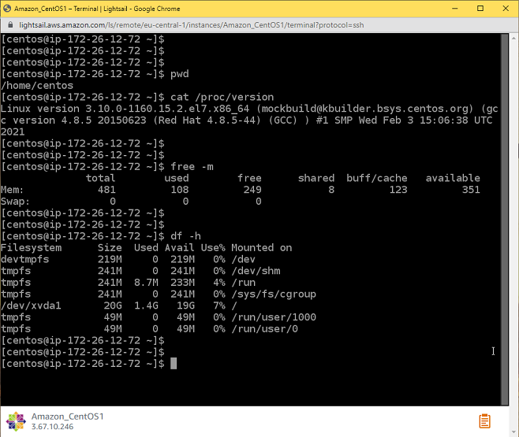  
    - SSH client:  
      
  - Deployment of servers through the AWS Management Console abd launching Amazon Elastic Compute Cloud (EC2) instances:  
  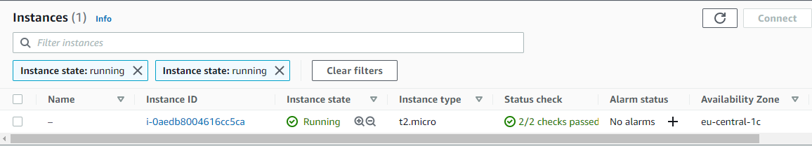  
    

  > Ubuntu Server 20.04 was chosen as the operating system instead of the recommended CentOS, as the latter is not available for free under Amazon Free Tier.  

  - Saving the state of the VM by making snapshots:  
  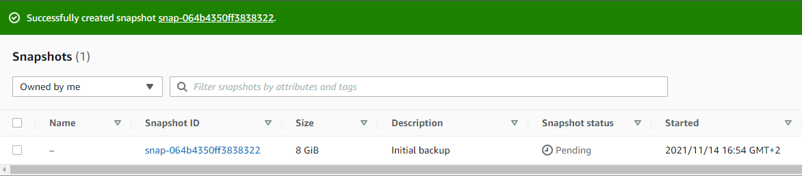  
  - Creation of Elastic Block Store (EBS) instances, their connection to the existing EC2 and execution of the necessary settings in the VM's OS to make added EBS available for data storage:
  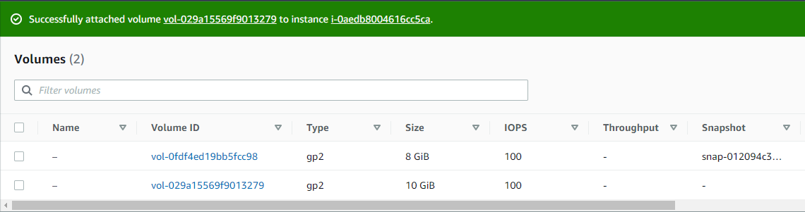
  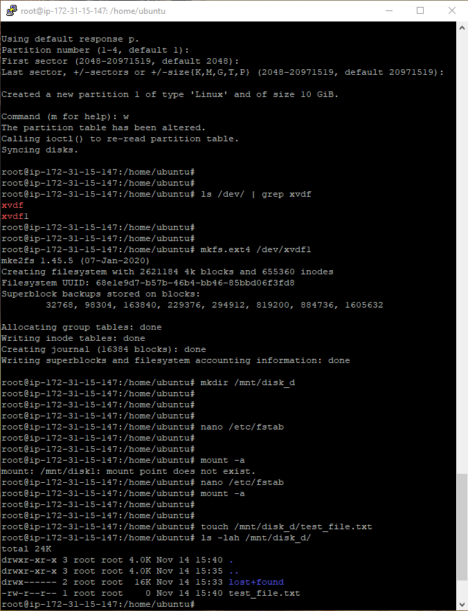
  - Deploying an instance from a backup. For this:
    - an image was created from the Snapshots section based on a previously taken snapshot of the VM:
    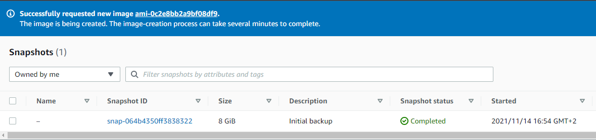
    - launched a new instance of EC2 from the created image:
    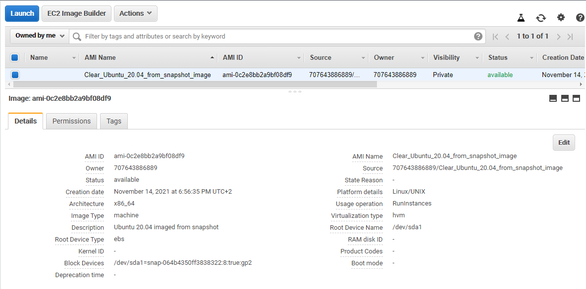
    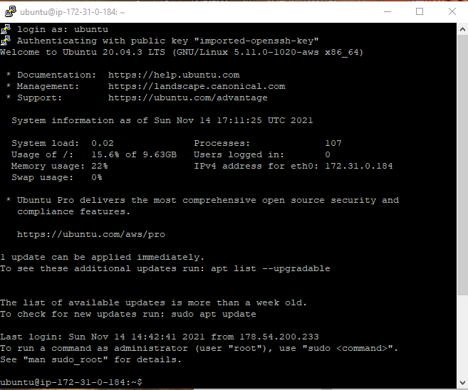
  - Transfer of the previously created EBS disk from the first VM to the second:
  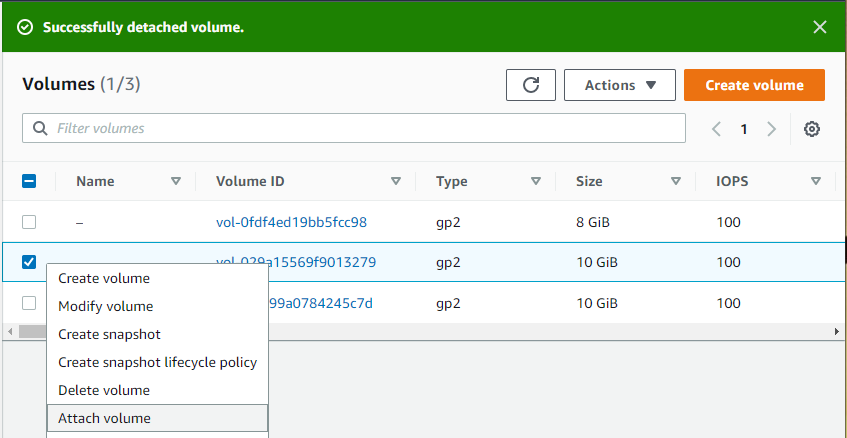
  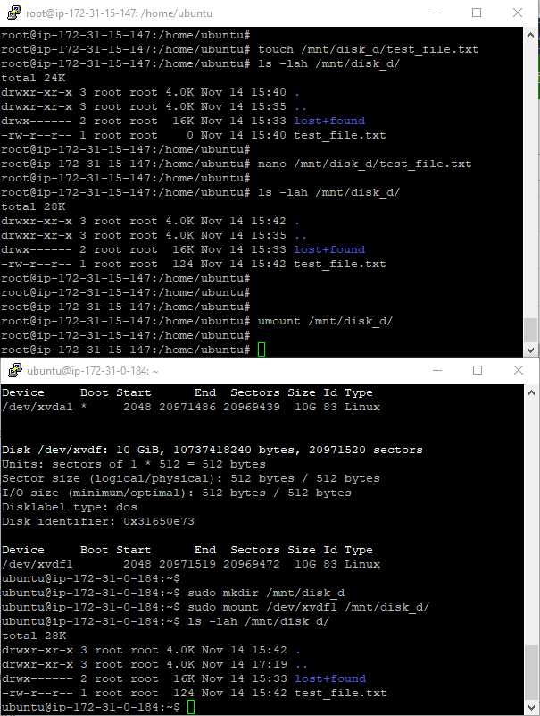
  - Creating and configuring a WordPress instance using Amazon Lightsail, setting up a static IP address, DNS:
  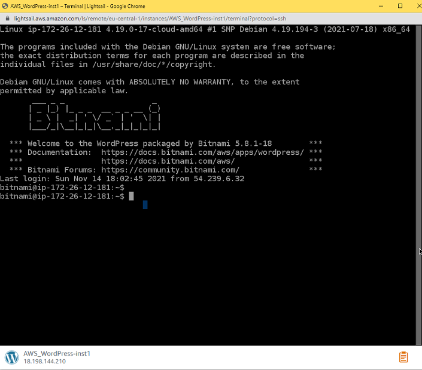
  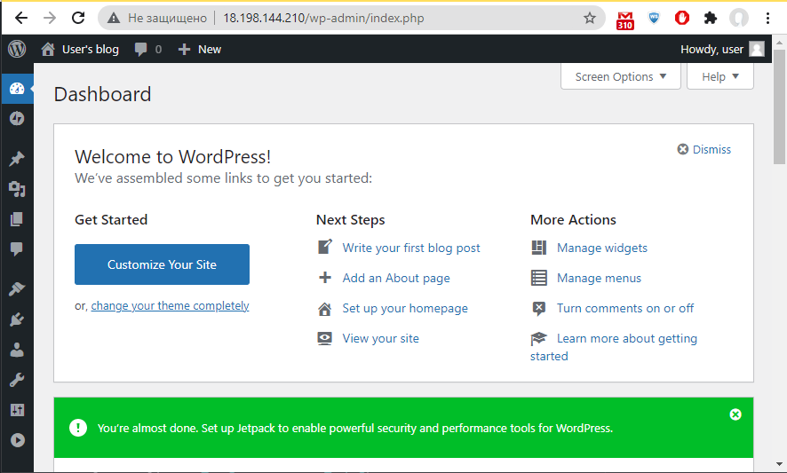
  - Creating an instance of Simple Storage Service (S3) and:
    - Uploading files to/from the bucket via the web-interface of the S3 service.
    - Create an AWS Identity and Access Management (IAM) user.
    - Installing and configuring CLI AWS.
    - Download files to/from bucket via AWS CLI:
    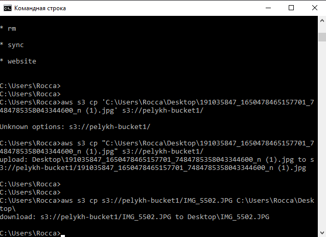
  - Possibilities of creating own domain and domain name using the AWS-service Route53 have been explored.
  
