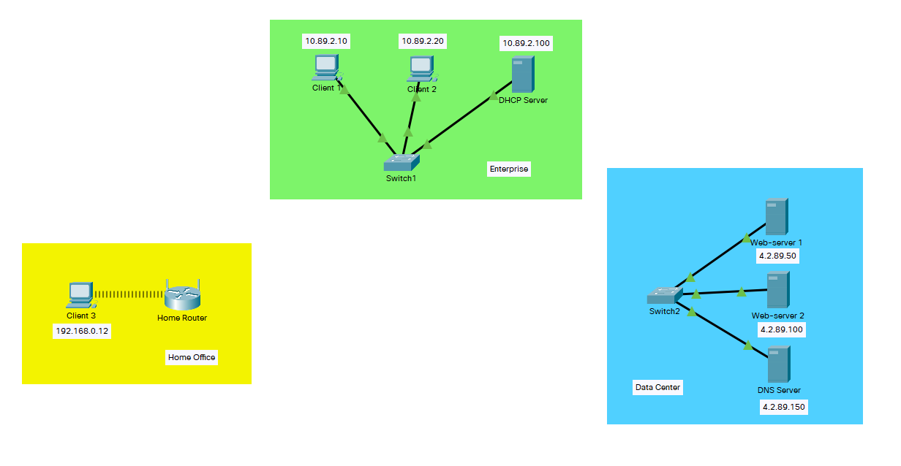
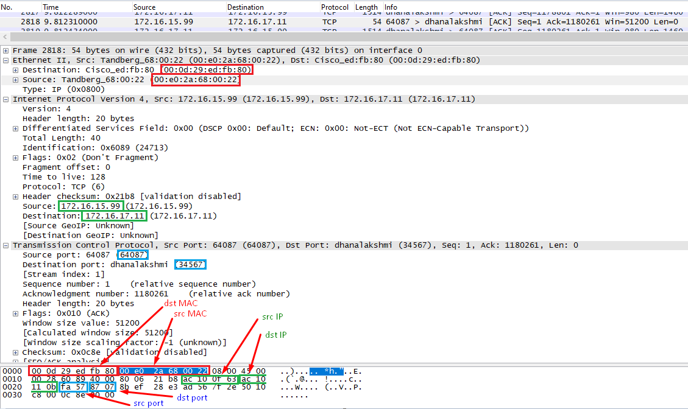
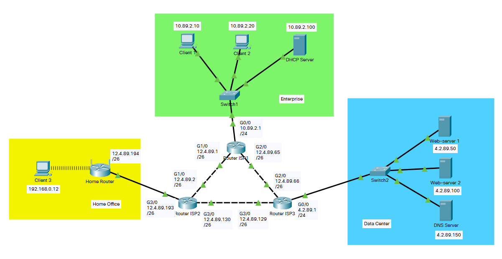
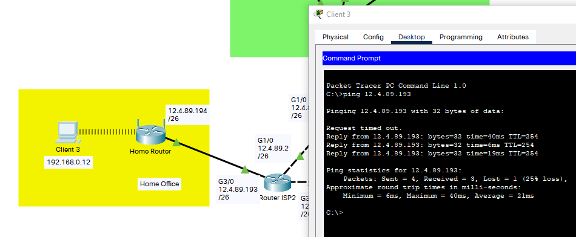
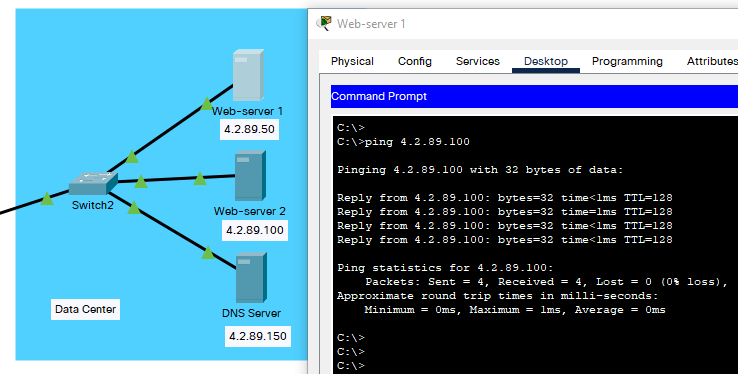
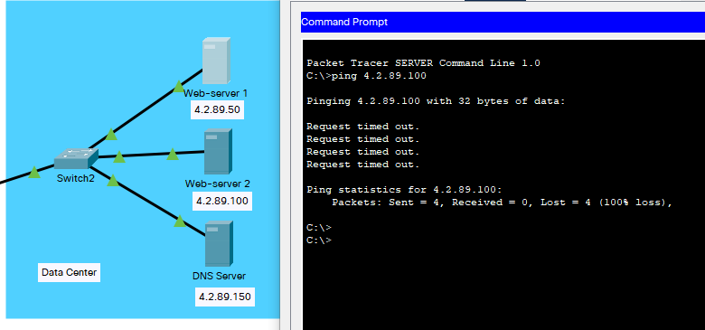
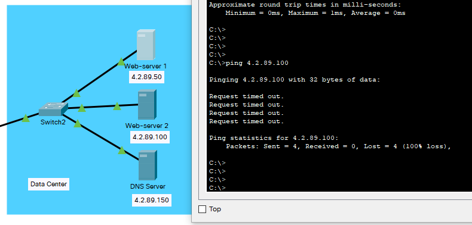
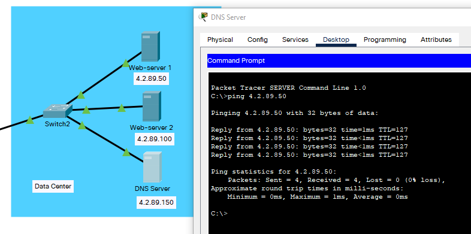
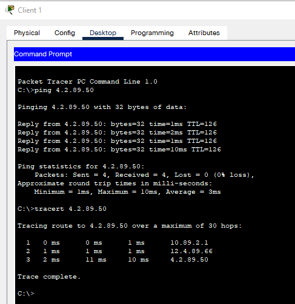
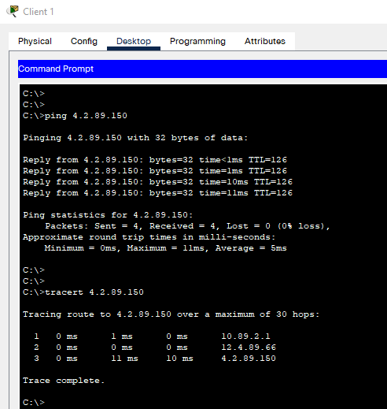

# Завдання 3.1  
 Під час виконання завдання було:  
 - закріплено знання з статичної ІР-адресації,  
 - побудовано окремі сегменти тестової мережі в емуляторі Cisco Packet Tracer, присвоєно статичні ІР-адреси пристроям та протестовано зв'язки між ними в рамках кожного сегменту:  
   
 - проведено аналіз TCP-сегменту в програмному аналізаторі трафіку Wire Shark:  
   
 MAC-адреса відправника: 00:0d:29:ed:fb:80  
 MAC-адреса отримувача: 00:e0:2a:68:00:22  
 IP-адреса відправника: 172.16.15.99  
 IP-адреса отримувача: 172.16.17.11  
 TCP-порт відправника: 64087  
 TCP-порт отримувача: 34567  

# Завдання 3.2  
 - Змодельовано з'єднання Internet між раніше створеними сегментами мережі:
   
 - Перевірено зв'язок комп’ютерів з власними шлюзами:  
   
 - Зв'язок серверів в Data Center між собою:  
   
 - Якщо змінити маску на серверах із 255.255.255.0 на 255.255.255.192, то зв'язок буде втрачено, оскільки сервери таким чином із ІР-параметрами: 4.2.89.50/26, 4.2.89.100/26, 4.2.89.150/26 - вже належатимуть до різних підмереж, про які не міститься ніякої інформації ні у таблицях маршрутизації самих серверів, ні маршрутизатора ISP3, який виступає їхнім шлюзом за промовчанням:  
   
 - Виконано налаштування VLAN на портах комутатора Switch2 (access):  

 >Switch2(config)#interface FastEthernet0/2
 >Switch2(config-if)#switchport access vlan 2
 >Switch2(config-if)#exit
 >Switch2(config)#interface FastEthernet0/3
 >Switch2(config-if)#switchport access vlan 3
 >Switch2(config-if)#exit
 >Switch2(config)#interface FastEthernet0/4
 >Switch2(config-if)#switchport access vlan 4
 >Switch2(config-if)#exit  

 Сервери ДЦ все так же лишились недоступними один для одного, оскільки назначення портів на комутатрі Switch2 у різні VLAN лише посилило ступінь їхньої ізоляції. Для організації доступності між собою потрібне конфігурування маршрутизації між VLAN на маршрутизаторі Router ISP3.  
   
 - Налаштування маршрутизації між VLAN (додаткове завдання), маршрутизатор Router ISP3:  

 >Router-ISP3(config)#interface GigabitEthernet0/0.2
 >Router-ISP3(config-subif)#encapsulation dot1Q 2
 >Router-ISP3(config-subif)#ip address 4.2.89.1 255.255.255.192
 >Router-ISP3(config-subif)#exit
 >Router-ISP3(config)#interface GigabitEthernet0/0.3
 >Router-ISP3(config-subif)#encapsulation dot1Q 3
 >Router-ISP3(config-subif)#ip address 4.2.89.65 255.255.255.192
 >Router-ISP3(config-subif)#exit
 >Router-ISP3(config)#interface GigabitEthernet0/0.4
 >Router-ISP3(config-subif)#encapsulation dot1Q 4
 >Router-ISP3(config-subif)#ip address 4.2.89.129 255.255.255.192
 >Router-ISP3(config-subif)#exit

 Після цього сервери отримали можливість пінгувати один одного:  
   

# Завдання 3.3  
 - Виконано налаштування статичної маршрутизації у змодельованій мережі:  
 >Router-ISP2(config)#ip route 10.89.2.0 255.255.255.0 12.4.89.1  
 >Router-ISP2(config)#ip route 4.2.89.0 255.255.255.0 12.4.89.129  
 >Router-ISP2(config)#ip route 12.4.89.64 255.255.255.192 12.4.89.1   
 >  
 >Router-ISP1(config)#ip route 12.4.89.192 255.255.255.192 12.4.89.2  
 >Router-ISP1(config)#ip route 4.2.89.0 255.255.255.0 12.4.89.66  
 >Router-ISP1(config)#ip route 12.4.89.128 255.255.255.192 12.4.89.66  
 >  
 >Router-ISP3(config)#ip route 12.4.89.192 255.255.255.192 12.4.89.130  
 >Router-ISP3(config)#ip route 10.89.2.0 255.255.255.0 12.4.89.65  
 >Router-ISP3(config)#ip route 12.4.89.0 255.255.255.192 12.4.89.130  

Отримано повну доступність усіх хостів мережі з усіма:  
  

- Налаштування динамічної маршрутизації на базі протоколу RIP (додаткове завдання):  

>Router-ISP2(config)#router rip  
>Router-ISP2(config-router)#network 12.0.0.0  
>  
>Router-ISP1(config)#router rip  
>Router-ISP1(config-router)#network 10.0.0.0
>Router-ISP1(config-router)#network 12.0.0.0
>  
>Router(config)#router rip  
>Router(config-router)#network 12.0.0.0  
>Router(config-router)#network 4.0.0.0  

Отримано повну доступність усіх хостів мережі з усіма:  
  
