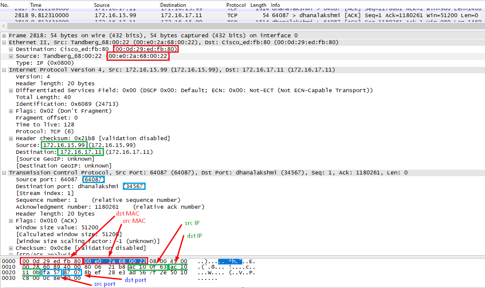
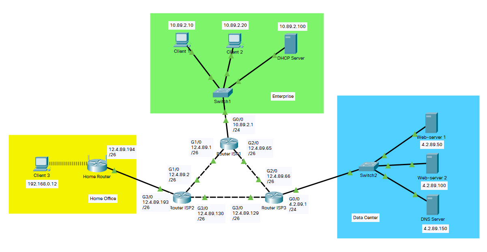
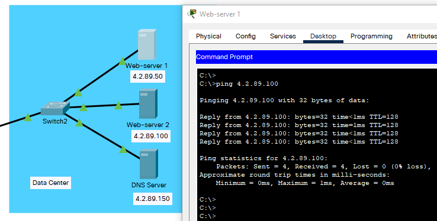
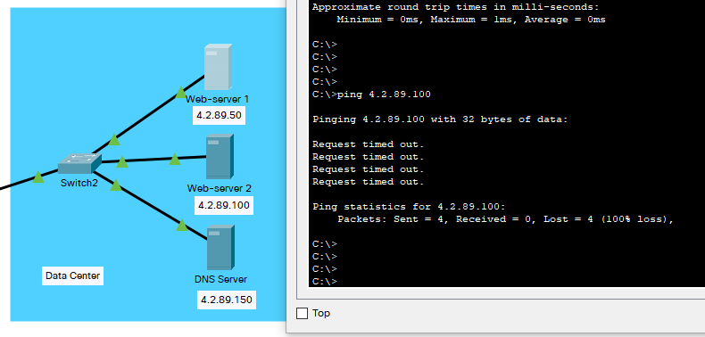
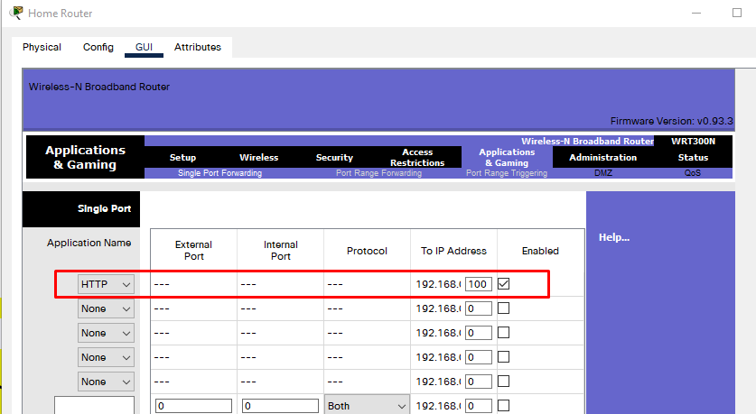

# Task 3.1. Creating networks Home Office, Enterprise, Data Center  
 In this task:  
 - knowledges of static IP-addressing were remained,  
 - separate segments of the test network in the Cisco Packet Tracer emulator were built, static IP addresses were assigned to devices and connections between them were tested:  
   
 - TCP-segment analysis was performed with Wire Shark traffic analyzer:  
   
 Sender's MAC address: 00:0d:29:ed:fb:80  
 Recipient's MAC address: 00:e0:2a:68:00:22  
 Sender's IP address: 172.16.15.99  
 Recipient's IP address: 172.16.17.11  
 Sender's TCP port: 64087  
 Recipient's TCP port: 34567  

# Task 3.2. Connecting seperate networks with Internet and VLAN  
 - Simulated Internet connection between previously created network segments:  
   
 - Checked the connection of computers with their own gateways:  
   
 - Communication of servers in the Data Center with each other:  
   
 - If change the mask on the servers from 255.255.255.0 to 255.255.255.192, the connection will be lost, because the servers got thus following IP parameters: 4.2.89.50/26, 4.2.89.100/26, 4.2.89.150/26 - so them already will belong to different subnets, about which no information is contained either in the routing tables of the servers themselves, or in the routing table of ISP3 router, which is their default gateway:  
   
 - VLAN configuration on Switch2 (access) ports:  

 > Switch2 (config) #interface FastEthernet0/2  
 > Switch2 (config-if) #switchport access vlan 2  
 > Switch2 (config-if) #exit  
 > Switch2 (config) #interface FastEthernet0/3  
 > Switch2 (config-if) #switchport access vlan 3  
 > Switch2 (config-if) #exit  
 > Switch2 (config) #interface FastEthernet0/4  
 > Switch2 (config-if) #switchport access vlan 4  
 > Switch2 (config-if) #exit  

 The DC servers still remained inaccessible to each other, as assigning ports on the Switch2 to different VLANs only increased their isolation. To organize accessibility between them, it's need to configure routing between VLANs on the Router ISP3.  
   
 - Routing settings between VLANs (optional), Router ISP3:  

 > Router-ISP3 (config) #interface GigabitEthernet0/0.2  
 > Router-ISP3 (config-subif) #encapsulation dot1Q 2  
 > Router-ISP3 (config-subif) #ip address 4.2.89.1 255.255.255.192  
 > Router-ISP3 (config-subif) #exit  
 > Router-ISP3 (config) #interface GigabitEthernet0/0.3  
 > Router-ISP3 (config-subif) #encapsulation dot1Q 3  
 > Router-ISP3 (config-subif) #ip address 4.2.89.65 255.255.255.192  
 > Router-ISP3 (config-subif) #exit  
 > Router-ISP3 (config) #interface GigabitEthernet0/0.4  
 > Router-ISP3 (config-subif) #encapsulation dot1Q 4  
 > Router-ISP3 (config-subif) #ip address 4.2.89.129 255.255.255.192  
 > Router-ISP3 (config-subif) #exit  

 After that, the servers were able to ping each other:  
   

# Task 3.3. Routing settings  
 - Static routing settings in the simulated network are performed:  

 > Router-ISP2 (config) #ip route 10.89.2.0 255.255.255.0 12.4.89.1  
 > Router-ISP2 (config) #ip route 4.2.89.0 255.255.255.0 12.4.89.129  
 > Router-ISP2 (config) #ip route 12.4.89.64 255.255.255.192 12.4.89.1  
 >  
 > Router-ISP1 (config) #ip route 12.4.89.192 255.255.255.192 12.4.89.2  
 > Router-ISP1 (config) #ip route 4.2.89.0 255.255.255.0 12.4.89.66  
 > Router-ISP1 (config) #ip route 12.4.89.128 255.255.255.192 12.4.89.66  
 >  
 > Router-ISP3 (config) #ip route 12.4.89.192 255.255.255.192 12.4.89.130  
 > Router-ISP3 (config) #ip route 10.89.2.0 255.255.255.0 12.4.89.65  
 > Router-ISP3 (config) #ip route 12.4.89.0 255.255.255.192 12.4.89.130  

 Full availability of all network hosts with all:  
   

 - Configuring of the dynamic routing based on the RIP protocol (additional task):  

 > Router-ISP2 (config) #router rip  
 > Router-ISP2 (config-router) #network 12.0.0.0  
 >  
 > Router-ISP1 (config) #router rip  
 > Router-ISP1 (config-router) #network 10.0.0.0  
 > Router-ISP1 (config-router) #network 12.0.0.0  
 >  
 > Router (config) #router rip  
 > Router (config-router) #network 12.0.0.0  
 > Router (config-router) #network 4.0.0.0  

 Full availability of all network hosts with all:  
   

# Task 3.4. DHCP, DNS, NAT settings  
 - Setting up DHCP Server in the Enterprise network:  
   
 - Enterprise network clients received IP parameters via DHCP:  
   
 - DNS Server settings:  
   
 DNS checking:  
   
 - Configuring Port Forwarding on the Home Router (additional task):  
   
 Checking the operation of port-forwarding:  
   
