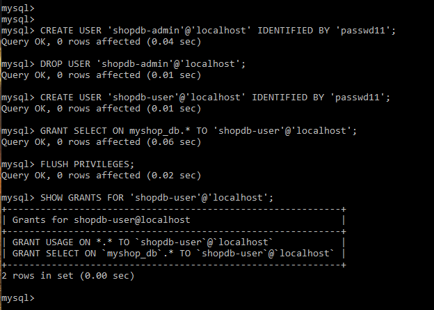
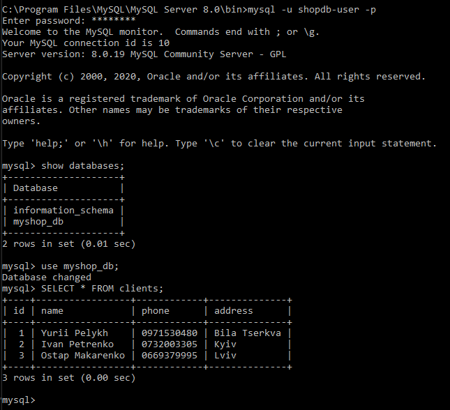

# Завдання 4.1

 Під час виконання завдання було закріплено основи адміністрування БД, а саме:  
  - Встановлення MySQL server.  
  - Опис схеми БД. В якості тестової змодельовано наступну структуру БД:  
    
  - Створення БД через консоль:  
    
  - Наповнення таблиць командою INSERT:  
    
  - Виконання запитів до БД за допомогою оператора SELECT та WHERE, GROUP BY і ORDER BY:  
    
  - Створення нових користувачів бази даних, призначення їм прав:  
    
    
