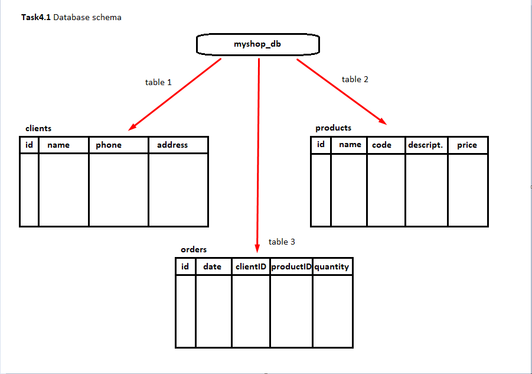
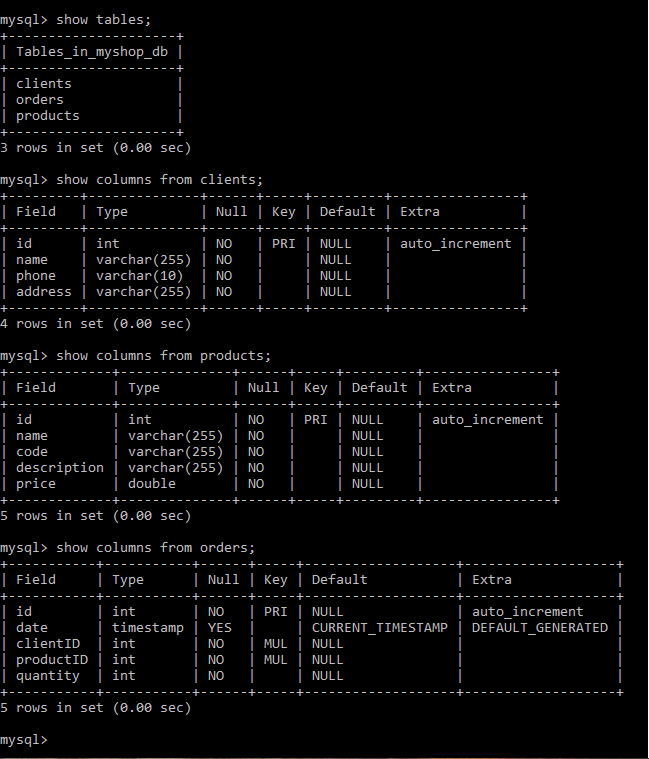
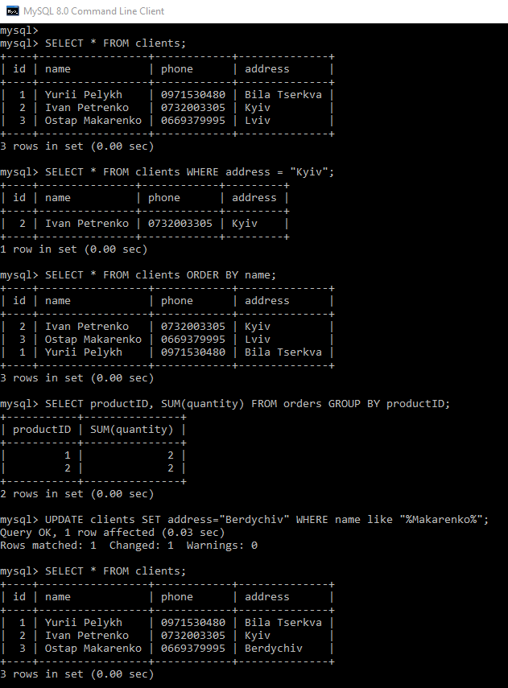
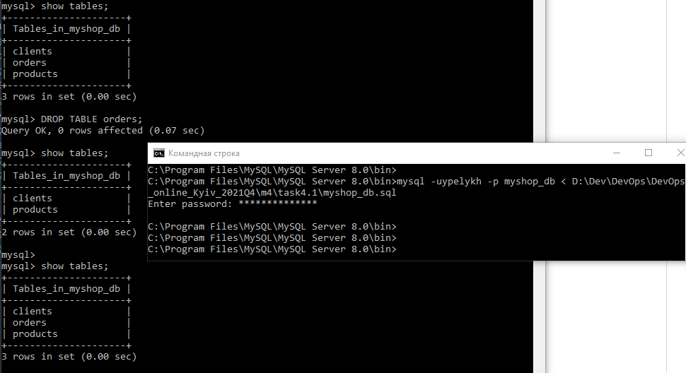
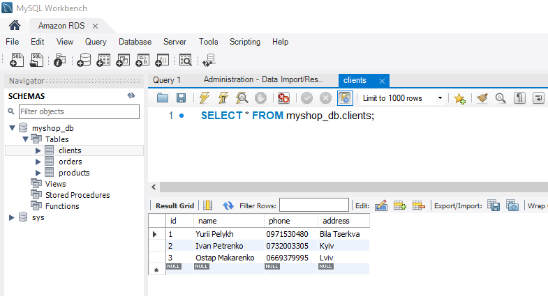
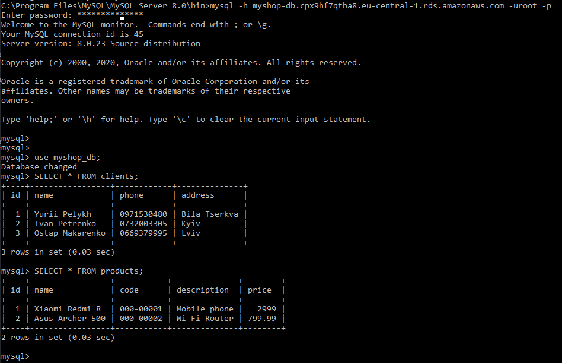

# Завдання 4.1

## Частина 1
 Під час виконання завдання було закріплено основи адміністрування БД, а саме:  
  - Встановлення MySQL server.  
  - Опис схеми БД. В якості тестової змодельовано наступну структуру БД:  
    
  - Створення таблиць БД через консоль:  
    
  - Наповнення таблиць командою INSERT:  
    
  - Виконання запитів до БД за допомогою оператора SELECT та WHERE, GROUP BY і ORDER BY:  
    
  - Створення нових користувачів бази даних, призначення їм прав:  
    
    

## Частина 2
 - Виконання експорту (бекапу) та імпорту (відновлення) БД:  
   
   
 - Створення БД MySQL на AWS RDS:  
   
 - Перенесення локальної БД на AWS RDS:  
   
 - Виконання запитів до БД через CLI:  
   
 - Створення дампу БД засобами AWS RDS та Workbench:  
   
   

## Частина 3

aws dynamodb put-item --table-name clients --item '{"client_name": {"S": "Petro Ivanenko"}, "phone_number": {"S": "0732003305"}, "address": {"S": "Berdychiv"}}' --return-consumed-capacity TOTAL
