# Task 4.1  

## Part 1  
 The basics of database administration were learned, namely:  
  - Installing MySQL server.  
  - Design of the database schema. The following database structure was modeled:  
  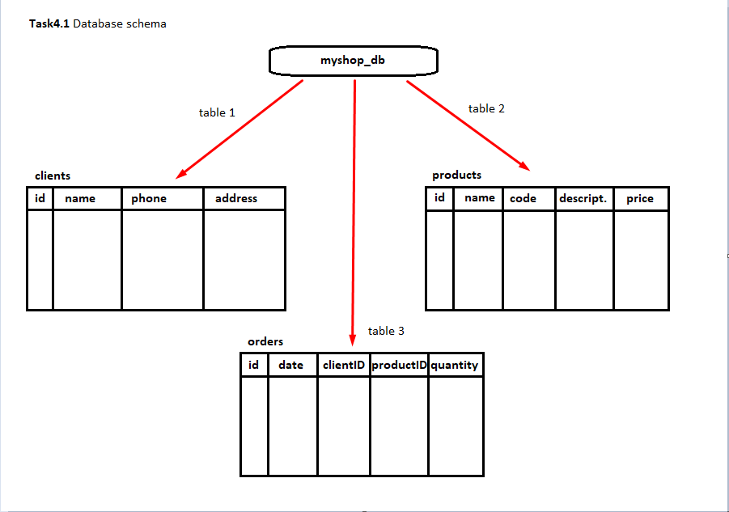  
  - Creating database tables through the console:  
  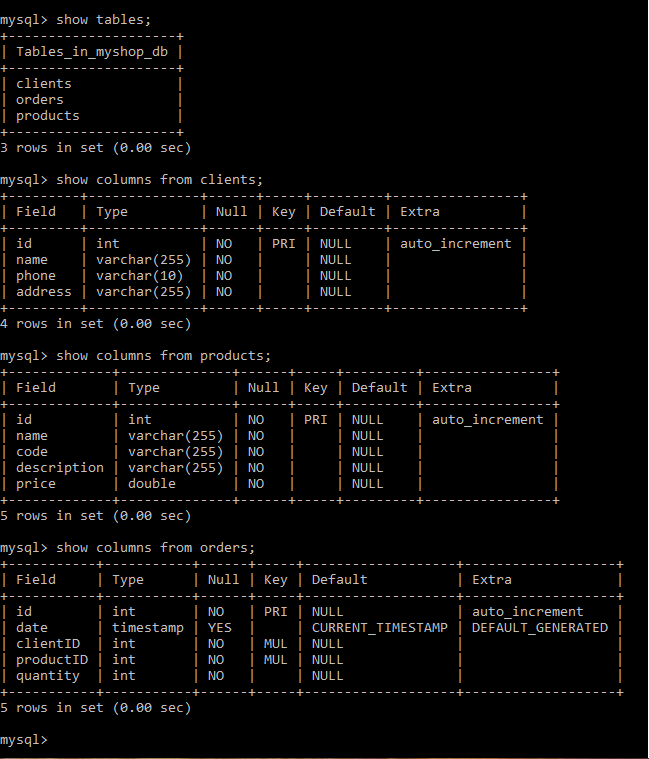  
  - Filling tables with INSERT command:  
  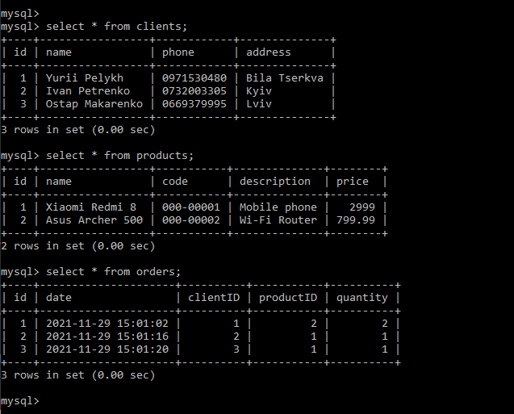  
  - Execution of queries to the database using SELECT and WHERE, GROUP BY and ORDER BY:  
  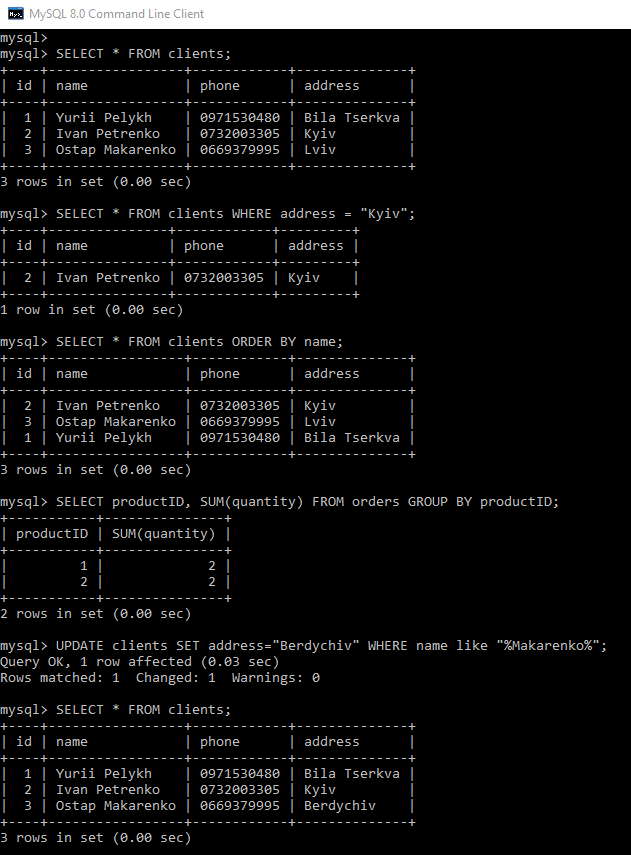  
  - Creating new database users, assigning rights to them:  
  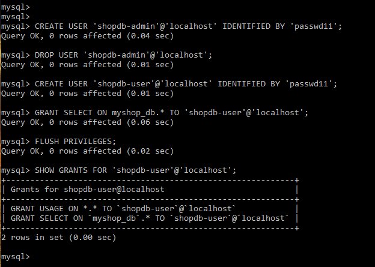  
  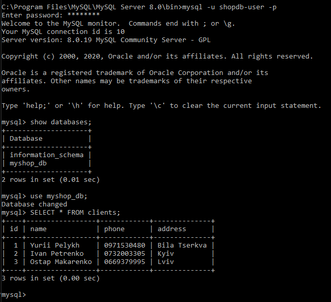  

## Part 2  
 - Execution of export (backup) and import (recovery) of the database:  
 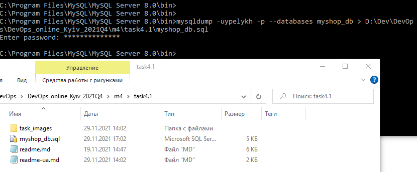  
 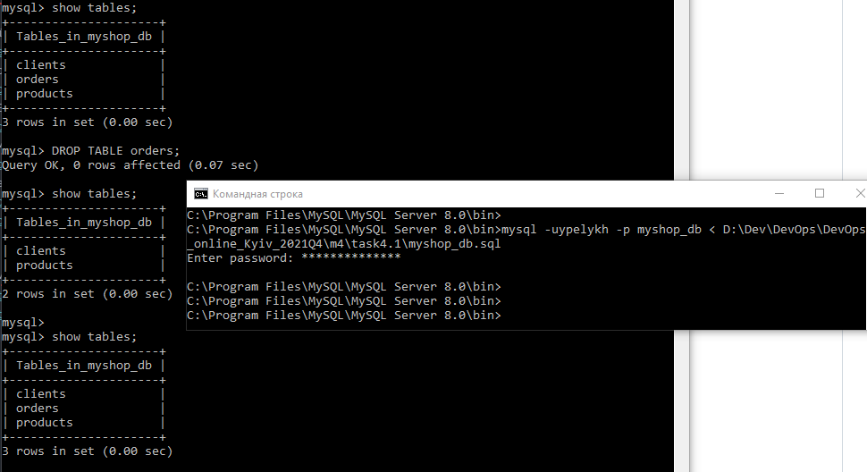  
 - Creating a MySQL database on AWS RDS:  
 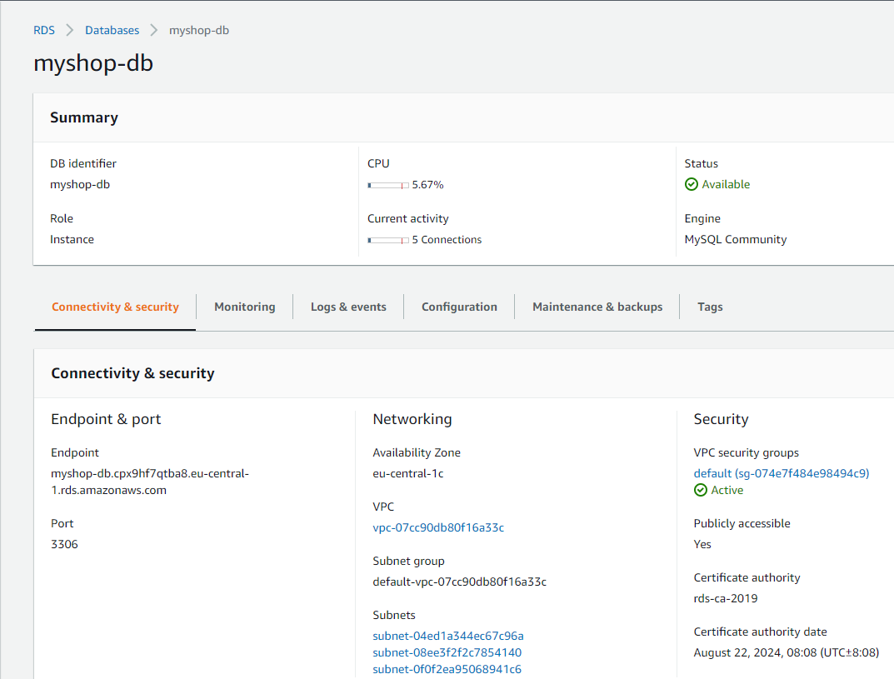  
 - Transfer of local database to AWS RDS:  
 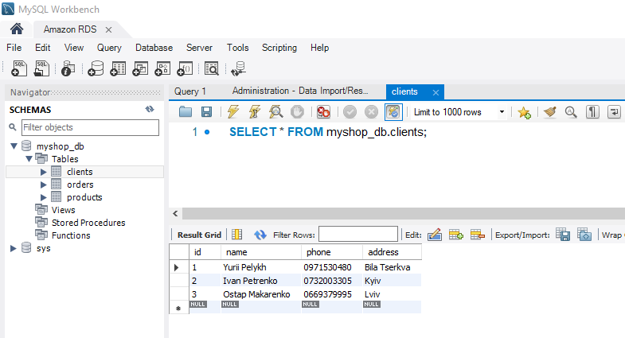  
 - Execution of queries to the remote database via CLI:  
 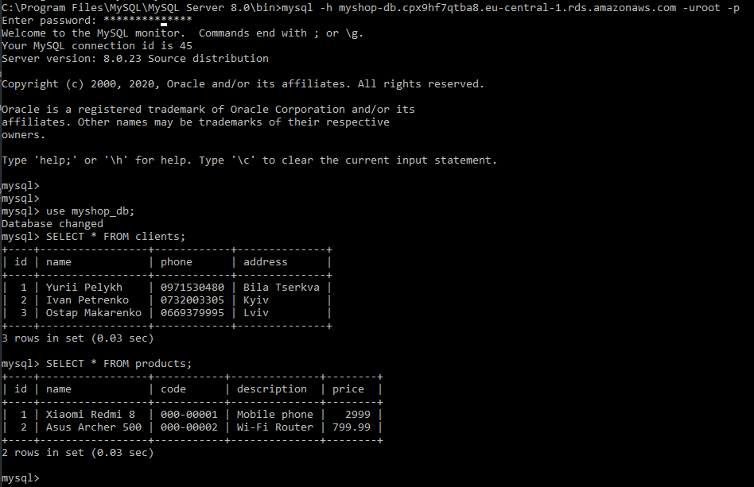  
 - Creating a database dump using AWS RDS and Workbench:  
 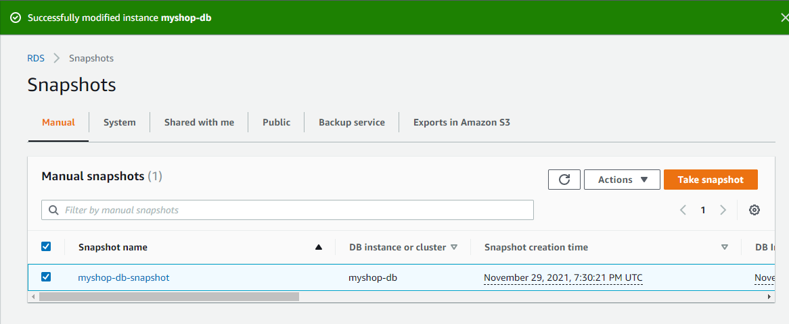  
 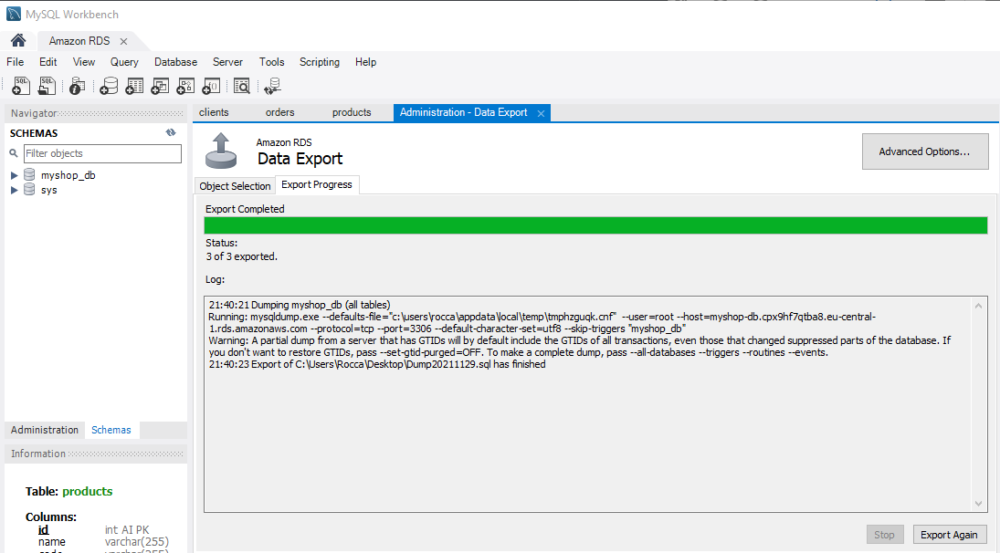  

## Part 3  
 - Creating Amazon DynamoDB (NoSQL-DB) tables:  
   - via DynamoDB Management Console.  
   - via CLI:  
   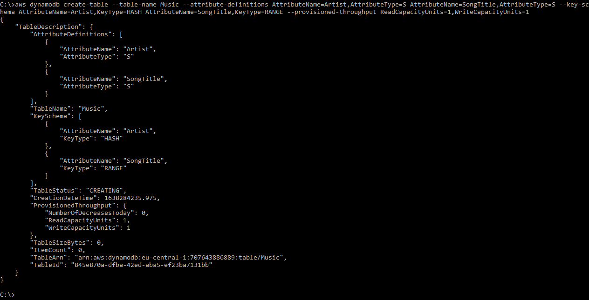  
 - Filling DynamoDB tables:  
 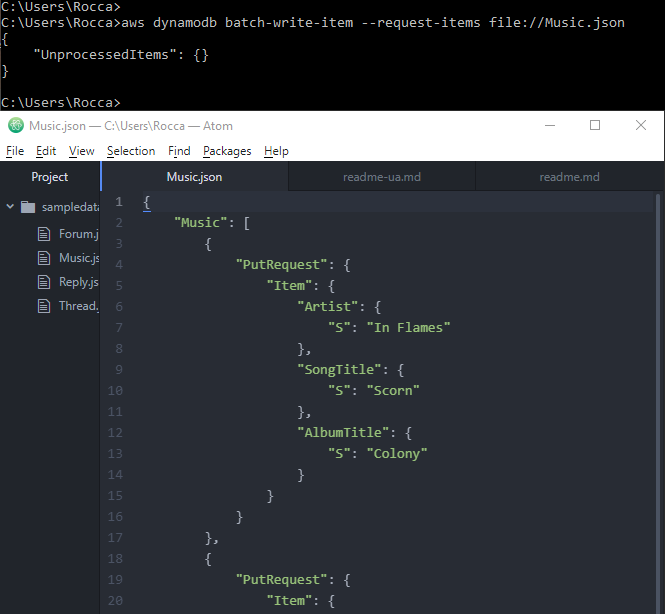  
 - Execution of queries to Amazon DynamoDB tables (Query and Scan):  
 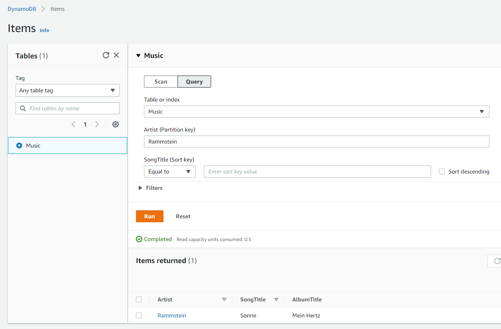  
 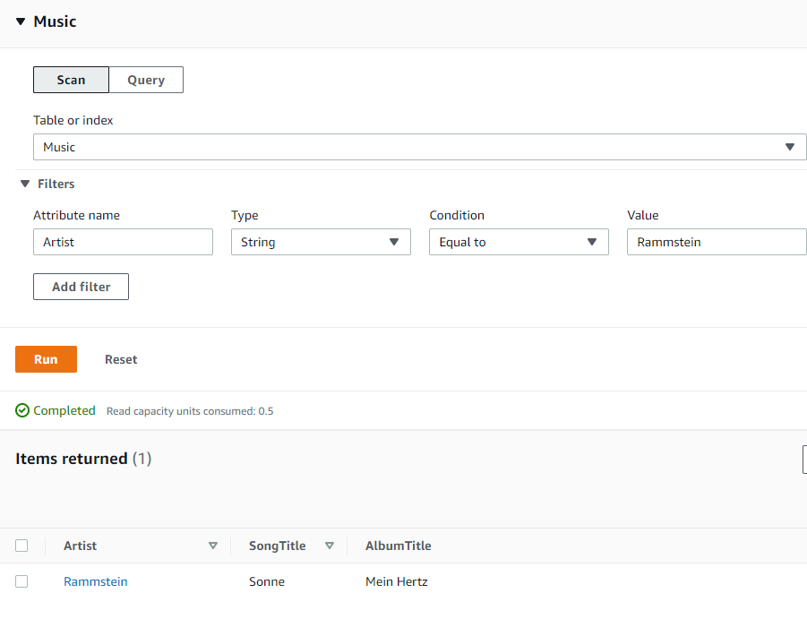  
