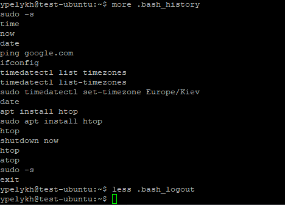
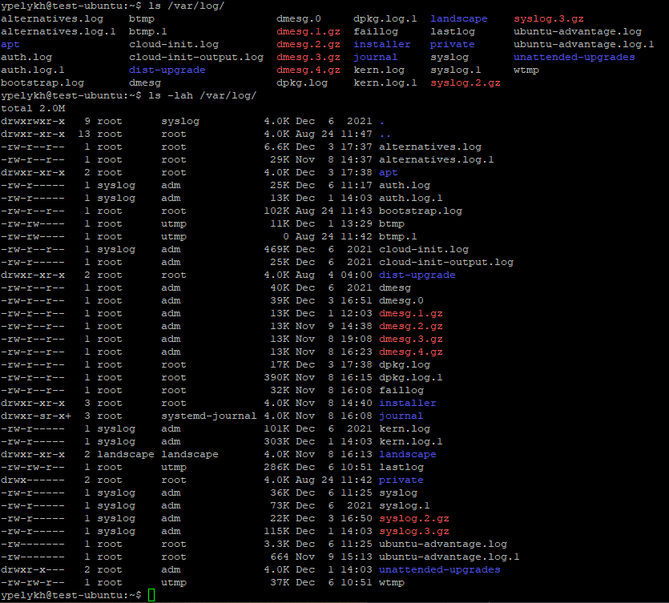

# Task 5.1  

The basics of Linux were learned, namely:  
## Part 1  
 1. Logging in to the system as root.  
 2. Changing the password and examination the basic parameters of the command **passwd**:  
   
 When changing a user's password it's hash saves to the system file /etc/shadow:  
   
 3. Determination of the users registrations in the system, as well as what commands they execute with commands **who** and **w**:  
   
 An additional information can be gleaned from the above command execution:
   - FROM - an IP-address, which user is connected from.
   - TTY - users are logged on through terminal.
   - IDLE - user has been idle for a specific amount of time.
   - JCPU - is the time used by all processes attached to the tty. It does not include past background jobs, it does include  currently running background jobs.
   - PCPU - is the time used by the current process, named in the "what" field.
 4. Changing personal information:  
   
 5. Got aquainted with the Linux help system, **man** and **info** commands. Got help on the previously discussed commands:  
   
 Definition and description of any two keys for these commands:  
   - w: **-s**, --short - Using of the short format.  Don't print the login time, JCPU or PCPU times.  
   - w: **-h**, --no-header - Don't print the header.  
 6. Exploration of the **more** and **less** commands using the help system. View the contents of files .bash* using commands:  
   
 7. *Description in plans that you are working on laboratory work 1. (Tip: You should read the documentation for the finger command):  
   
 8. Listing the contents of the home directory using the **ls** command, definition its files and directories. (Hint: Use the help system to familiarize yourself with the ls command):  
   

## Part 2  

 1. Examination of the **tree** command. Testing of applying a template, for example, display all files that contain a character "c", or files that contain a specific sequence of characters. List subdirectories of the root directory up to and including the second nesting level.  
   
 2. Command **file** can be used to determine the type of file (for example, text or binary):  
   
 3. Improving the skills of navigating the file system using relative and absolute paths. Using symbol '~' we can go back to home directory from anywhere in the filesystem:  
   
 4. Consolidation of knowledges about various options for the **ls** command. Examples of listing directories using different keys are below:  
   
 Using the switches:  
 **-l** - for list presentation of directory content;  
 **-a** - displays all content of a directory including hidden files and current and parent directories (. and ..);  
 **-h** - human readable file sizes.  
 5. Performed the following sequence of operations:  
   - creation of a subdirectory in the home directory:  
     
   - in created subdirectory created a file containing information about directories located in the root directory (using I/O redirection operations):  
     
   - copy the created file to home directory using relative and absolute addressing:  
     
   - delete the previously created subdirectory with the file requesting removal;  
   - delete the file copied to the home directory:  
     
 6. Performing the following sequence of operations:  
   - create a subdirectory test in the home directory;  
   - copy the .bash_history file to this directory while changing its name to labwork2:  
     
   - create a hard and soft link to the labwork2 file in the test subdirectory:  
     
   **Soft (symbolic) link** - pointer to a file via its path specification, like a link in Windows.  
   **Hard link** - pointer to a file's identification number in filesystem (inode).  
   - change the data by opening a symbolic link. What changes will happen and why?  
     
   If an original file has been modified, a date of modification of it's hard link also modifies, but modification date of symbolic link stays without changes, because hard link is just a pointer to the original file's inode and displays a properties of recently modified original file.  
   - rename the hard link file to hard_lnk_labwork2;  
   - rename the soft link file to symb_lnk_labwork2 file;  
   - then delete the labwork2. What changes have occurred and why?  
     
   If the original file is deleted, the symbolic link is not removed, but is useless. Hard link still work and original file still be accessible, it is keeping in system till at least one hard link points to it.  
 7. Using the locate utility, find all files that contain the "squid" and "traceroute" sequence:  
   
 8. Determination which partitions are mounted in the system, as well as the types of these partitions:  
   
 9. Count the number of lines containing a given sequence of characters in a given file:  
   
 10. Using the find command, find all files in the /etc directory containing the "host" character sequence:  
   
 11. List all objects in /etc that contain the "ss" character sequence. How can I duplicate a similar command using a bunch of grep?  
   - Looking in object names:  
     
   - Looking in files content:  
     
     
 12. Organize a screen-by-screen print of the contents of the /etc directory. Hint: You must use stream redirection operations:  
   
 13. Types of devices:  
 **Character Device**  
 These devices transfer data, but one a character at a time. You'll see a lot of pseudo devices (/dev/null) as character devices, these devices aren't really physically connected to the machine, but they allow the operating system greater functionality.  
 **Block Device**  
 These devices transfer data, but in large fixed-sized blocks. You'll most commonly see devices that utilize data blocks as block devices, such as hard drives, filesystems, etc.  
 **Pipe Device**  
 Named pipes (also First In First Out (FIFO) buffers) allow two or more processes to communicate with each other, these are similar to character devices, but instead of having output sent to a device, it's sent to another process.  
 **Socket Device**  
 Socket devices facilitate communication between processes, similar to pipe devices but they can communicate with many processes at once.  
 **How to determine the type of device?**  
 In the ls command we can see the type of file with the first bit on each line. Device files are denoted as the following:  
   - c - character
   - b - block
   - p - pipe
   - s - socket
   
 14. How to determine the type of file in the system, what types of files are there?
   
 Types of files:  
   - – : regular file  
   - d : directory  
   - c : character device file  
   - b : block device file  
   - s : local socket file  
   - p : named pipe  
   - l : symbolic link  
 15. *List the first 5 directory files that were recently accessed in the /etc directory:  
   
   
