# Tsk 5.2  

 1. Analyze the structure of the **/etc/passwd** and **/etc/group** file, what fields are present in it, what users exist on the system? Specify several pseudo-users, how to define them?  
 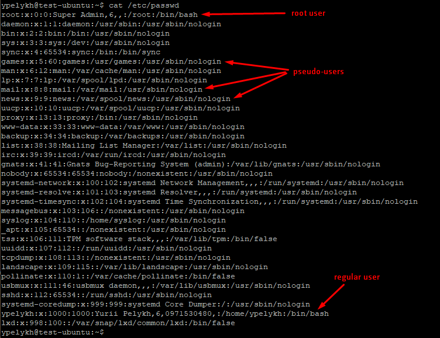  
 File **/etc/passwd** contains lines of the following form, separated by colons, each defines a linux user:  

 >  
 > ypelykh:x:1000:1000:Yurii Pelykh,6,0971530480,:/home/ypelykh:/bin/bash  
 >  

  Here:  
  **_ypelykh_** - username - must not contain a colon character (:), it is not recommended to use a period (.) in a name, or start it with "+";  
  **_x_** - means password, but really password hash is stored in file **/etc/shadow**. The password field can be empty, indicating that no password is required to register a user. It can also contain not more than 13 characters of the encrypted version of the password;  
  **_1000_** - UID - unique identifier of the user within the system;  
  **_1000_** - GID - unique identifier of the group within the system, which the user belongs to;  
  **_Yurii Pelykh,6,0971530480_** - UID comments - comment, extended user description, for example, full name, office, phone;  
  **_/home/ypelykh_** - user's home directory;  
  **_/bin/bash_** - program name the user's command interpreter.  

  Types of users:  
  - **Root** - root user;  
  - **Regular users** - like _ypelykh_;  
  - **System users**;  
  - **Daemons**;  
  - **Pseudo-users** - are not registered in the system and are only needed to confirm ownership of the processes. Their descriptions are never edited. Examples: _sshd_, _tcpdump_, _proxy_.  

  File **/etc/group** contains lines of existing user groups in system:  
  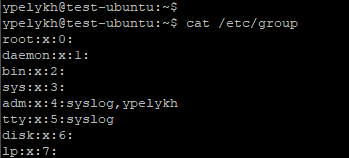  

  The format for line in this file is:  
  >  
  > adm:x:4:syslog,ypelykh  
  >  

  Here:  
  **_adm_** - group name - contains the text name for the group.  
  **_x_** - password - contains the encrypted password of this group (really password is stored in file **/etc/shadow**).  
  **_4_** - group ID - contains a unique identifier for this group.  
  **_syslog,ypelykh_** - list field, which contains a comma separated list of users belonging to this group.  

  Users do not need to be included in the list of those groups that are specified as their primary in the /etc/passwd file.  

  2. What are the UID ranges? What is UID? How to define it?  
  **UID** is a simple numeric designation for an individual user. This is usually a positive number not more than 65535. Some identifiers are reserved for special use. UID-ranges are following:  
  - 0 - root user,  
  - 1 - 9 - system and reserved users,  
  - 10 - 99 - pseudo users,  
  - 100 - 999 - daemons,  
  - 1000 - ... - regular users.  

  3. What is GID? How to define it?  
  GID - Group ID - unique identifier of the group within the system, which the user belongs to. GID can be defined from file **/etc/passwd** or **/etc/group**.  

  4. How to determine belonging of user to the specific group?  
  With **groups** command:  
  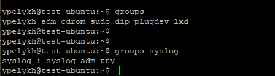  

  5. What are the commands for adding a user to the system? What are the basic parameters required to create a user?  
  Command **adduser** can be used to create a user in the system. User's name is required parameter to create a new user. **adduser** utiliy also asks a password for new user. This is sufficient parameters for user creation procedure, but additional parameters may be also specified, for example a group, which user must belongs to, user's home directory, user's command interpreter.  
  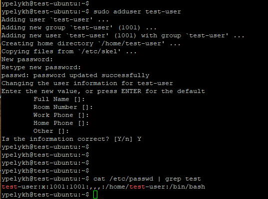  

  6. How do I change the name (account name) of an existing user?  
  To change username command **usermod** can be used:  
  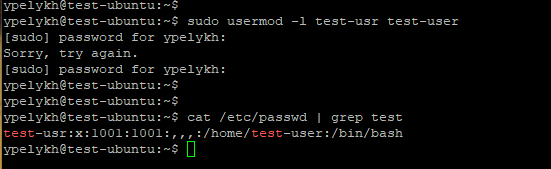  

  7. What is skell_dir? What is its structure?  
  The **/etc/skel** directory contains files and directories that are automatically copied over to a new user’s home directory when such a user is created by the **useradd** program:  
  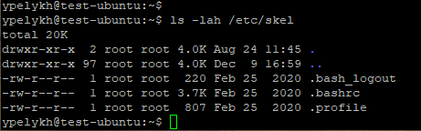  

  8. How to remove a user from the system (including his mailbox)?  
  Its possible with **userdel** command and additional switch **-r** to remove home directory and mail spool:  
  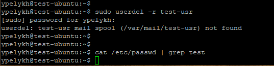  

  9. What commands and keys should be used to lock and unlock a user account?  
  Command **usermod** can be used to lock user account or to unlock it:  
     _usermod -L LOGIN_ - locks account;  
     _usermod -U LOGIN_ - unlocks account;  

  10. How to remove a user's password and provide him with a password-free login for subsequent password change?  
  The command **passwd** with the switch **-e, --expire** can be used to immediately expire an account's password. This in effect can force a user to change their password at the user's next login:  
  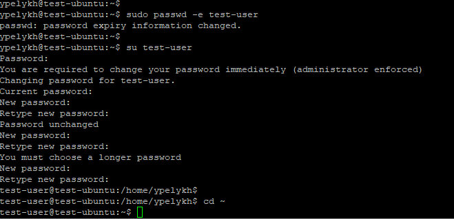  

  11. Display the extended format of information about the directory, tell about the information columns displayed on the terminal.  
  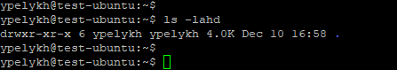  
  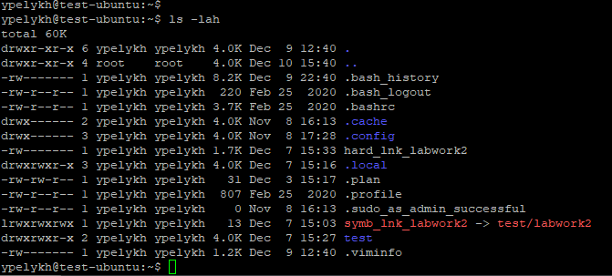  
  >  
  > drwxrwxr-x 2 ypelykh ypelykh 4.0K Dec  7 15:27 test  
  >  

    **drwxrwxr-x** - file type (directory), directory access rules,  
    **2** - count of links, which point to this directory (file),  
    **ypelykh** - owner name,  
    **ypelykh** - owner group,  
    **4.0K** - file size,  
    **Dec  7 15:27** - time of last modification,  
    **test** - the name of the file or directory.  

  12. What access rights exist and for whom (i. e., describe the main roles)? Briefly describe the acronym for access rights.  
  An access rights are defined for:  
    - owner,  
    - group,  
    - others.  
  There are three available permissions for each:  
    - r - permission to read,  
    - w - permission to write,  
    - x - permission to execute.  
  Example of access rights acronym: **rwxrwxr-x**  
  File's or directory's:  
    - _owner_ can: **r**ead, **w**rite, e**x**ecute;  
    - _group_ can: **r**ead, **w**rite, e**x**ecute;  
    - _other_ can: **r**ead, e**x**ecute;  

  13. What is the sequence of defining the relationship between the file and the user?  
  Watch output of **ls** or **dir** command for the file:  
  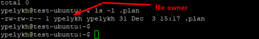  

  14. What commands are used to change the owner of a file (directory), as well as the mode of access to the file? Give examples, demonstrate on the terminal.  
  Command **chown** used to change file owner:  
  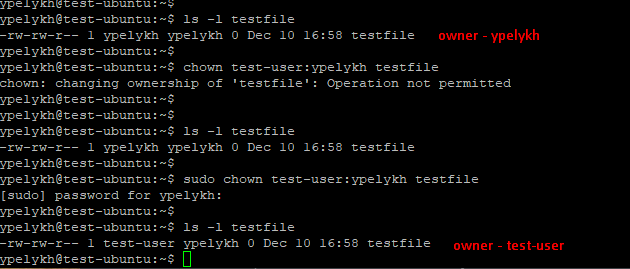  
  Command **chmod** can be used to modify access permitions to the file or directory:  
  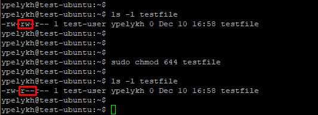  

  15. What is an example of octal representation of access rights? Describe the umask command.  
  For example, access rights acronym **rwxrwxr-x** can be interpreted in octal form as **775**:  
   - r - is for 4,  
   - w - is for 2,  
   - x - is for 1.  
  So **rwx** for owner gives 4+2+1=**7**, **rwx** for group gives also 4+2+1=**7**, **r-x** for others gives 4+0+1=**5**.  

  **umask** utility gives possibility to change default permissions for newly created files and directories.  
  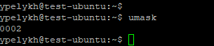  
  This **umask** value _0002_ contains permissions bits that will NOT be set on newly created files and directories.  
  **umask** affects only the current shell environment. On most Linux distributions, the default system-wide **umask** is set in the **pam_umask.so** or **/etc/profile file**. To specify a different value for each user, we can edit the user's shell configuration files such as **~/.bashrc** or **~/.zshrc**. Also possible to change the current **umask** value of the session by running _**umask**_ with the next desired value.  

  16. Give definitions of sticky bits and mechanism of identifier substitution. Give an example of files and directories with these attributes.  
  **Sticky bit** is mainly used on folders in order to avoid deletion of a folder and it’s content by other users though they having write permissions on the folder contents. If Sticky bit is enabled on a folder, the folder contents are deleted by only owner who created them and the root user.  
  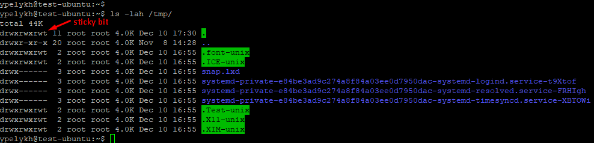  

  17. What file attributes should be present in the command script?  
  To have a possibility to be executed, script should have an execution permission **x** in its attributes:  
  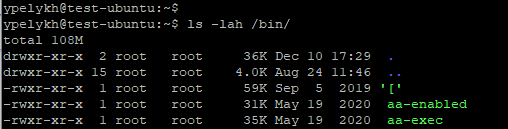  
