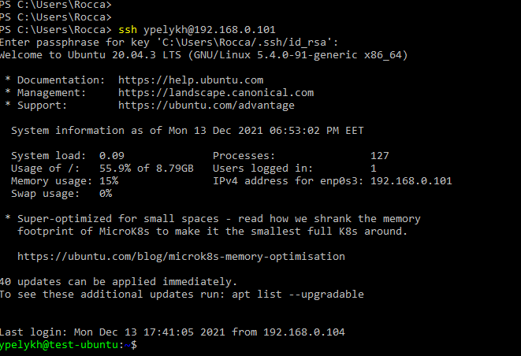
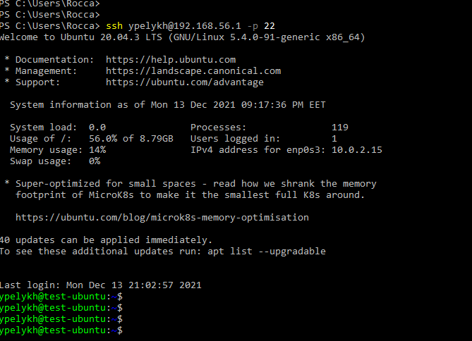

# Task 5.3  

##  Part 1  
  1. How many states could has a process in Linux?  
  Processes in Linux can take one of following states:  
    - created,  
    - ready,  
    - running,  
    - waiting,  
    - terminated.  

  2. Examine the **pstree** command. Make output (highlight) the chain (ancestors) of the current process.  
    
  Switch **-h** allows to highlight the current process and its ancestors.  

  3. What is a proc file system?  
  The **proc filesystem** (procfs) is a special filesystem in Unix-like operating systems that presents information about processes and other system information in a hierarchical file-like structure, providing a more convenient and standardized method for dynamically accessing process data held in the kernel than traditional tracing methods or direct access to kernel memory. Typically, it is mapped to a mount point named /proc at boot time.  

  4. Print information about the processor (its type, supported technologies, etc.).  
    

  5. Use the **ps** command to get information about the process. The information should be as follows: the owner of the process, the arguments with which the process was launched for execution, the group owner of this process, etc.  
    

  6. How to define kernel processes and user processes?  
    
  The name of kernel processes is in square brackets and user processes are without them.  

  7. Print the list of processes to the terminal. Briefly describe the statuses of the processes. What condition are they in, or can they be arriving in?  
    
  Using of switch **u** allows to display an information about process statuses, which can get following values:  
    - D - uninterruptible sleep (usually IO),  
    - I - idle kernel thread,
    - R - running or runnable (on run queue),  
    - S - interruptible sleep (waiting for a event to complete),  
    - T - stopped, either by a job control signal or because it is being traced,  
    - t - stopped by debugger during the tracing,  
    - W - paging (not valid since the 2.6.xx kernel),  
    - X - dead (should never be seen),  
    - Z - defunct ("zombie") process, terminated but not reaped by its parent.  
  Also additional characters can be used:  
    - < - high-priority (not nice to other users),  
    - N - low-priority (nice to other users),  
    - L - has pages locked into memory (for real-time and custom IO),  
    - S - is a session leader,  
    - L - is multi-threaded (using Clone_thread, like NPTL pthreads do),  
    - + - is in the foreground process group.

  8. Display only the processes of a specific user.
  **ps -u username u**:  
    

  9. What utilities can be used to analyze existing running tasks (by analyzing the help for the ps command)?  
  Result of **ps** command can be processes with **pgrep** utility to display only processes with running state (R):  **ps | pgrep -r R -a**
  **-r** switch - to look in processes states.
  **-a** switch - to list the full command line as well as the process ID.
    

  10. What information does top command display?  
  Utility **top** displays information about system resources usage (CPU, memory), processes and allows manage them:  
    

  12. Display the processes of the specific user using the top command.  
  To display the processes of the specific user using the top command the switch "-u" should be used with specification of user's login:  **top -u ypelykh**  
    

  12. What interactive commands can be used to control the top command? Give a couple of examples.  
  **t** - scroll information presentation about system resources usage (CPU load, memory consumption etc.),  
  **Enter** or **Space** - refresh display -  awaken top and following receipt of any input the entire display will be repainted.  
  **Z** - will  take you to a separate screen where you can change the colors for the current window, or for all windows.  
  **E** and **e** - extend memory scale in Summary Area and in Task Windows.  
  **h** - help.  

  13. Sort the contents of the processes window using various parameters (for example, the amount of processor time taken up, etc.)  
  To sort contents of Task window we can use interactive key:  
  **Shift + p** - sort by **p**rocessor usage,  
  **Shift + m** - sort by **m**emory usage,  
  **Shift + n** - sort by PID,  
  **Shift + t** - sort by **t**ime usage,  
  **Shift + >** or **Shift + <** - to move between columns and sort by content in each of them.  
    

  14. Concept of priority, what commands are used to set priority?  
  When Linux processes are started, they are started with a specific priority. By default, all regular processes are equal and are started with the same priority, which is the priority number 20 (PRI, not NI, this is middle).  
    
  The NI column in screenshot above, shows the scheduling priority or niceness of each process (NI). Niceness generally ranges from -20 to 19, with -20 being the most favorable or highest priority for scheduling and 19 being the least favorable or lowest priority. In some cases, it is useful to change the default priority that was assigned to the process when it was started. To change process priority we can use **nice** and **renice** commands:  
  > nice -n 5 dd if=/dev/zero of=/dev/null &  
  > renice -n 10 -p XXYY (XXYY is the PID).  

  15. Can I change the priority of a process using the top command? If so, how?  
  It is also possible to change priority of a process using the **top** command with key **r**.  

  16. Examine the kill command. How to send with the kill command process control signal? Give an example of commonly used signals.  
  **kill** command is used to interrupt a process.  
  _**kill -9 1345**_ - interrupts process with PID 1345. **-9** - control signal.  
  Commonly used signals:  
    - The signal SIGTERM (15) is used to ask a process to stop.  
    - The signal SIGKILL (9) is used to force a process to stop.  
    - The signal SIGHUP (1) signal is used to hang up a process. The effect is that the process will reread its configuration files, which makes this a useful signal to use after making modifications to a process configuration file.  

  17. Commands jobs, fg, bg, nohup. What are they for? Use the sleep, yes command to demonstrate the process control mechanism with fg, bg.  
  Commands launched from the console using the ampersand run in the background and are called **jobs**. We can say that tasks are processes tied to the shell. In addition to the traditional PID, such tasks also have their own numbering, starting with one. We can view the running tasks of the interpreter using the **jobs** command:  
    
  **Ctrl + C** - completes the process,  
  **Ctrl + Z** - stops the process.
  Stopped with **Ctrl + Z** jobs (or not such, but all) can be started with commands **fg** (forground) and **bg** (background). **fg 2** - will start job with ID 2 (top command), previously stopped on the screen. **bg 2** - the same but on background.
  If needed to start a process and exit the console so that the process continues to run on the system, there is only one way out - to transfer the child process to another process, which will be its parent. This feature is implemented in the **nohup** command. This command allows to start processes that will be disconnected from the terminal if the terminal is closed.

## Part 2
  1. Check the implementability of the most frequently used OPENSSH commands in the MS Windows operating system. (Description of the expected result of the commands + screenshots: command – result should be presented).  
  **ssh user@host** - connection to specified host under specified user via ssh.  
    
  **ssh-keygen** - generation of public/private rsa key pair:  
    

  2. Implement basic SSH settings to increase the security of the client-server connection (at least 3. List the options for choosing keys for encryption in SSH. Implement 3 of them.  
    1. Configuration of connection using SSH-key instead login and password:  
    Generated earlier (in task 2.1) public key should be shared to server into ~/.ssh/authorized_keys:  
    **cat C:\Users\Rocca\.ssh\id_rsa.pub | ssh ypelykh@192.168.0.101 "mkdir -p ~/.ssh && cat >> ~/.ssh/authorized_keys"**
      
      
    Encryption algorithms possible for SSH usage:  
     - RSA;  
     - DSA;  
     - ECDSA;  
     - ED25519.       
    2. Changing the default 22 ssh port to other:  
    Specification of new SSH port for listening for sshd we make in /etc/ssh/sshd_config:  
      
    Now sshd listens to port 20022 (netstat -ntlp):  
      
    3. Disabling of server SSH Root Login and password authentication:  
    /etc/ssh/sshd_config:  
    PasswordAuthentication no  
    PermitRootLogin no  
      

  3. Implement port forwarding for the SSH client from the host machine to the guest Linux virtual machine behind NAT.  
    
    
    

  4. *Intercept (capture) traffic (tcpdump, wireshark) while authorizing the remote client on the server using ssh, telnet, rlogin. Analyze the result.  
    
    
  Main difference between dumps of connections via ssh and for example telnet is in data encryption during SSH transmission, while it is absent during telnet session packets exchange.
