# Task 6.1 Networking with Linux  

  1. Testing virtual network was configured as shown on the figure 1:  
  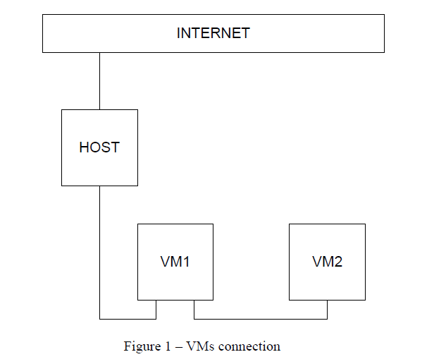  

  2. VM2 has one interface (internal), VM1 has 2 interfaces (NAT and internal). Configure all network interfaces in order to make VM2 has an access to the Internet (iptables, forward, masquerade).  
    1. **VM1:**  
     - second network card was added via Virtualbox Management Console:  
     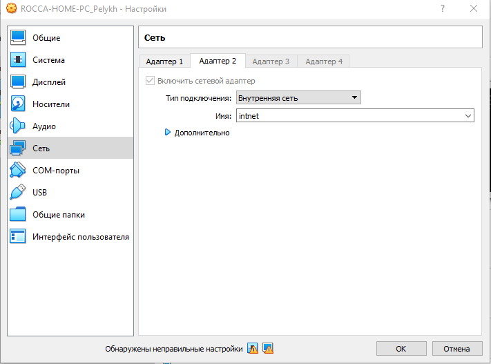  
     - Check a name given to added network interface:  
     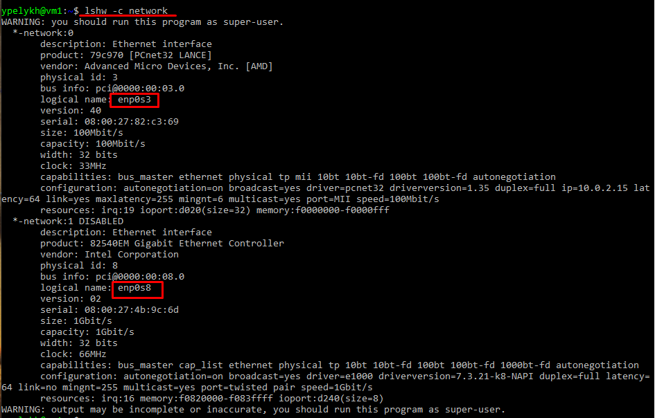  
     - ... and enabling interface:  
     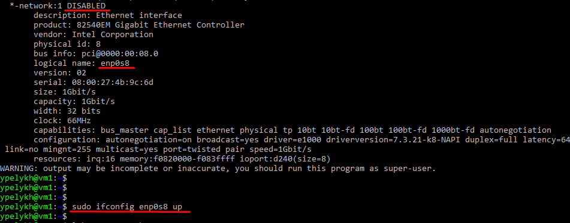  
     - Configuring a network interfaces via netplan settings config file:  
     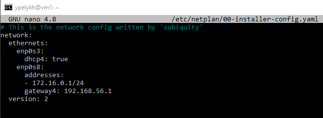  
     **sudo netplan apply** then.  
     - Network interfaces configuration now:  
     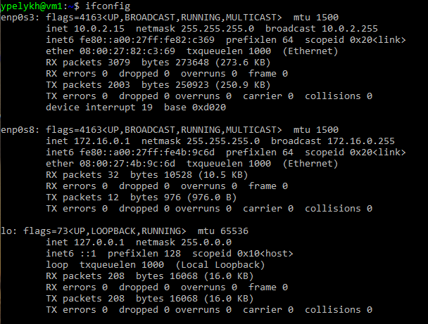  
     - Configuration of firewall:  
         _Cleaning all chains and removing rules:_  
         **iptables -F**  
         **iptables -F -t nat**  
         **iptables -F -t mangle**  
         **iptables -X**  
         **iptables -t nat -X**  
         **iptables -t mangle -X**  
         _Permiting of inbound traffic to loopback interface:_  
         **iptables -A INPUT -i lo -j ACCEPT**  
         _Accept all traffic from internal network on internal interface:_  
         **iptables -A INPUT -i enp0s8 -s 172.16.0.0/24 -j ACCEPT**  
         _Accepting ping (two most safety types):_  
         **iptables -A INPUT -p icmp --icmp-type 0 -j ACCEPT**  
         **iptables -A INPUT -p icmp --icmp-type 8 -j ACCEPT**  
         _Allow internal connections, which where permitted earlier:_  
         **iptables -A INPUT -m conntrack --ctstate RELATED,ESTABLISHED -j ACCEPT**  
         _Accepting traffic forwarding as well for new and current connections:_  
         **iptables -A FORWARD -i enp0s8 -o enp0s3 -m conntrack --ctstate NEW,RELATED,ESTABLISHED -j ACCEPT**  
         _Accepting forwarding from external network to internal only for packets, which are a part of existing connections:_  
         **iptables -A FORWARD -i enp0s3 -o enp0s8 -m conntrack --ctstate RELATED,ESTABLISHED -j ACCEPT**  
         _Make an adresses translation for IPs, which belong to local network:_  
         **iptables -t nat -A POSTROUTING -o enp0s3 -s 172.16.0.0/24 -j MASQUERADE**  
         _Configuring default policies:_  
         **iptables -P INPUT DROP**  
         **iptables -P FORWARD DROP**  
         **iptables -P OUTPUT ACCEPT**  
      Result config:  
      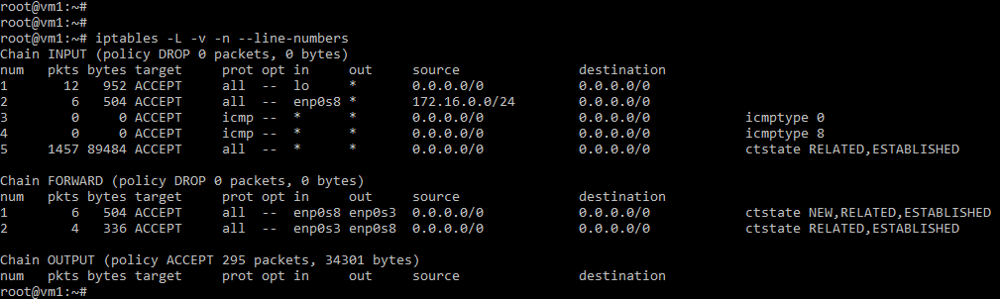  
      - Also enebled IPv4 forwarding in **/etc/sysctl.conf**:  
      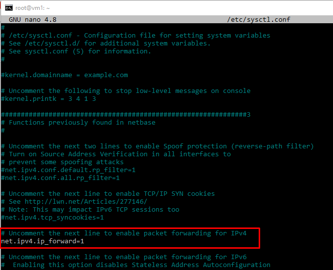  
    2. **VM2:**  
     - Configuring a network interface via netplan settings config file:  
     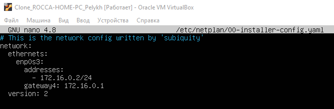  
     **sudo netplan apply** then.  
     - Result network interfaces configuration:  
     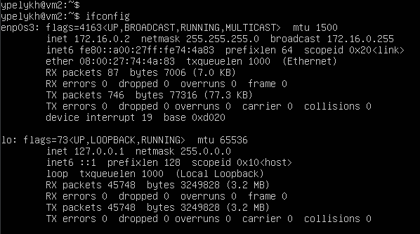  

  3. Check the route from VM2 to Host:  
  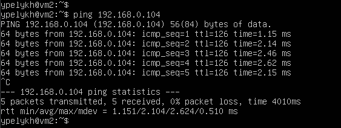  

  4. Check the access to the Internet, (just ping, for example, 8.8.8.8).  
  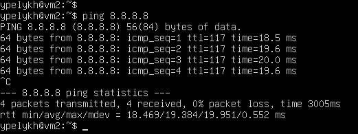  

  5. Determine, which resource has an IP address 8.8.8.8.  
  Changing netplan config to add nameservers:  
  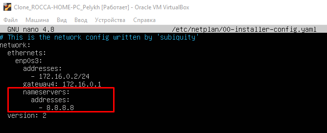  
  With command **host** possible to determine, that IP 8.8.8.8 8.8 belongs to public DNS service provided by Google:  
  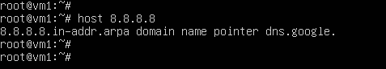  

  6. Determine, which IP address belongs to resource epam.com.  
  Using **nslookup** command:  
  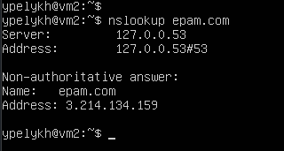  

  7. Determine the default gateway for your HOST and display routing table.  
  **mtr google.com**:  
  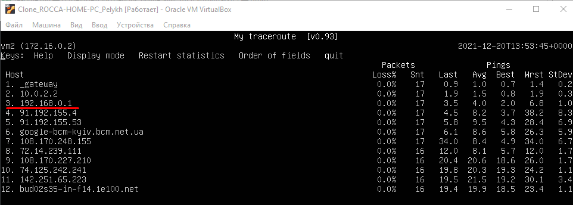  
  VM2 routing table:  
  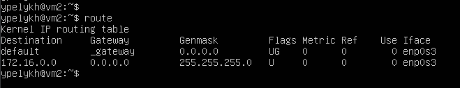  
  VM1 routing table:  
  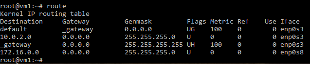  
  Host's routing table:  
  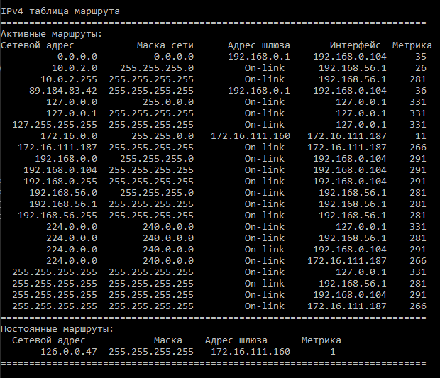  

  8. Trace the route to google.com:  
  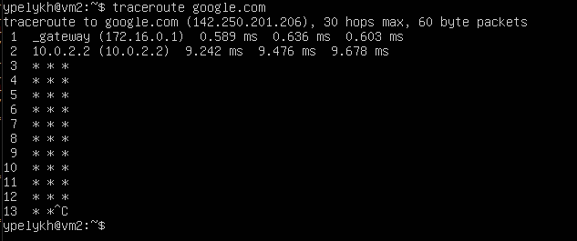  
  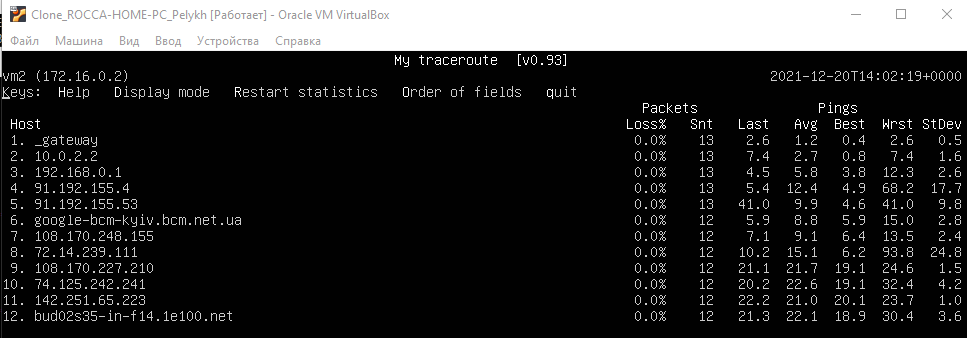  
