# Task 6.2 Configuring DHCP, DNS servers and dynamic routing using OSPF protocol  

1. Testing virtual network was configured as shown on the figure 1:  
  
VM1 has NAT and internal network connections, VM2 and VM3 – internal only interfaces.  

2. Installation and configuration of DHCP server on VM1.  
###   **Case 1:** Using ISC-DHCP-SERVER:  
 - **isc-dhcp-server** installation:  _**apt install isc-dhcp-server**_.  
 - Editing config **/etc/default/isc-dhcp-server**:  
 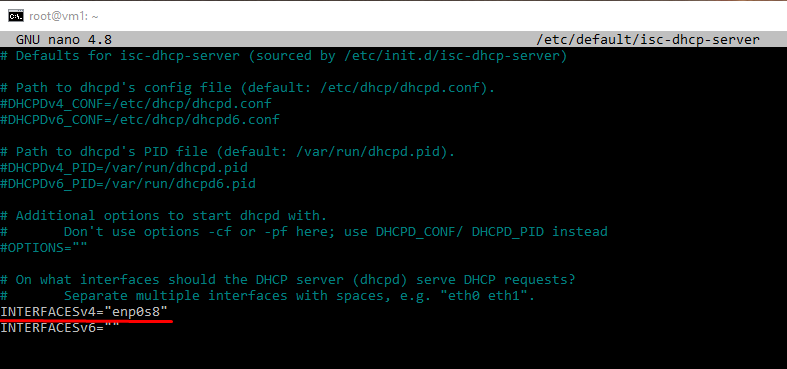  
 - Editing config **/etc/dhcp/dhcpd.conf** (previously copied to **/etc/dhcp/dhcpd.conf.backup**):  
 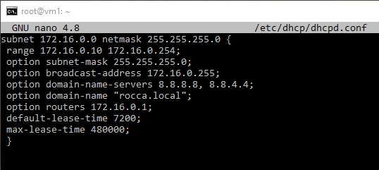  
 - starting of **isc-dhcp-server**:  
 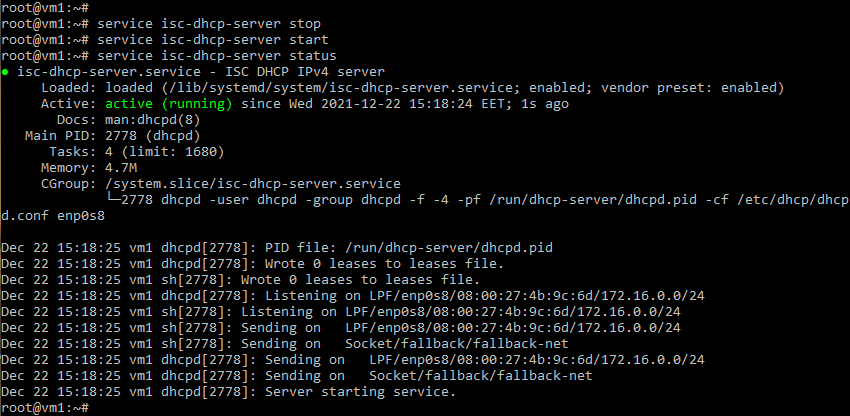  
 - Change interface config on VM2 and VM3 to get network settings via dhcp and check result:  
 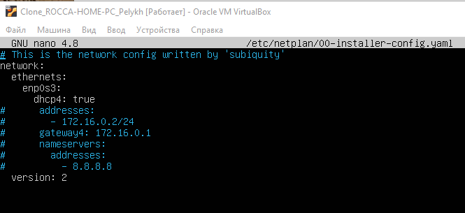  
 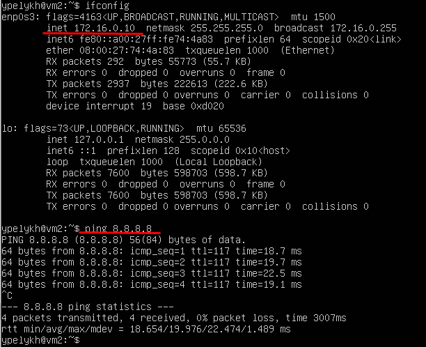  

###   **Case 2:** Using DNSMASQ:  
 - **dnsmasq** installation:  _**apt install dnsmasq**_.  
 - Editing config **/etc/default/isc-dhcp-server**:  
 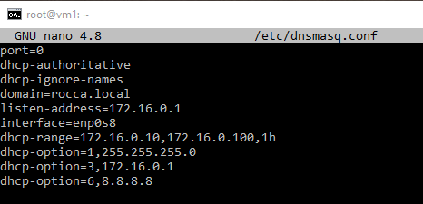  
 - Starting **dnsmasq**:  
 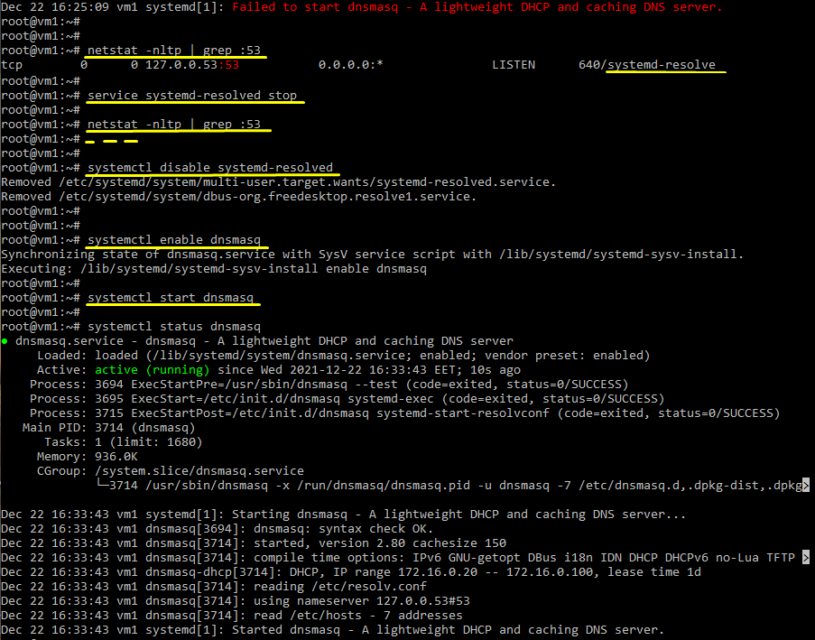  

3. Check VM2 and VM3 for obtaining network addresses from DHCP server:  
 - Changing interface config on VM3 to get network settings via DHCP (on VM2 it was done earlier):  
 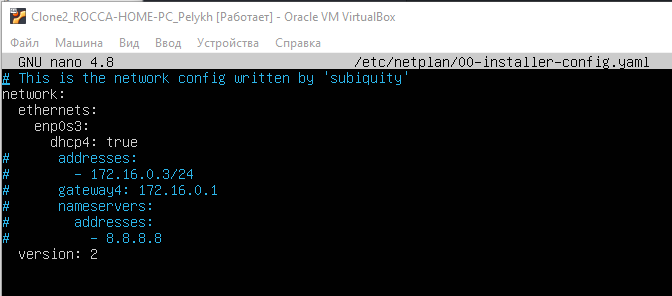  
 - Checking results:  
 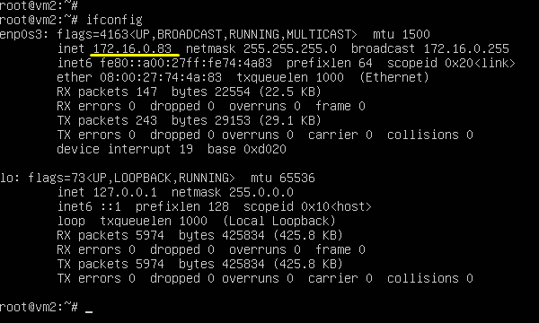  
 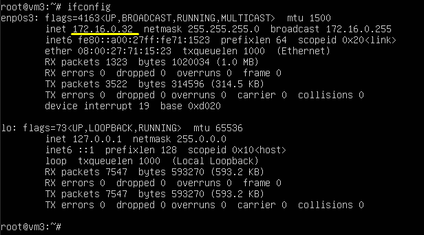  
 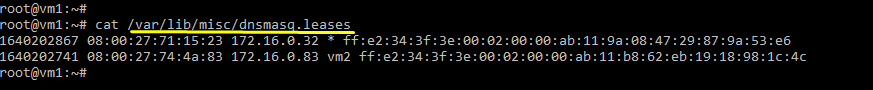  

4. Using existed network for three VMs (from p.1) install and configure DNS server on VM1. (You can use DNSMASQ, BIND9 or something else).  
 - **DNSMASQ** was used to configurate DNS:  
 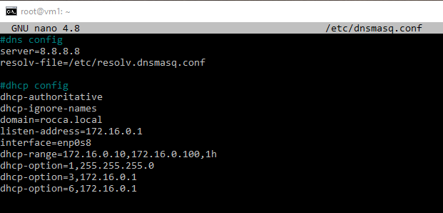  
 - Separate file resolv.dnsmasq.conf was created, because original symbolic link (_**resolv.conf -> ../run/systemd/resolve/stub-resolv.conf**_) becomes unworking after service **systemd-resolved** was disabled and OS reboot:  
 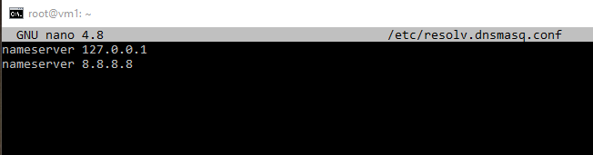  
 - **DNSMASQ** working principles:  
 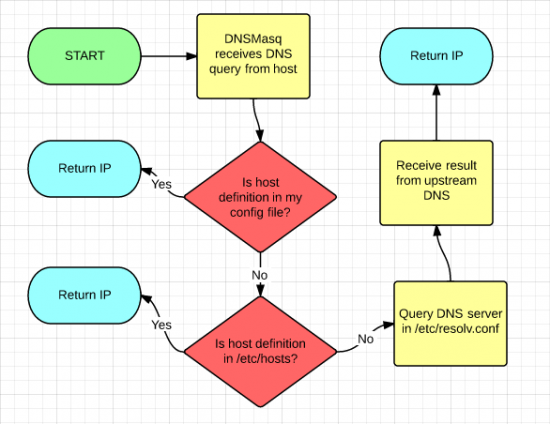  

5. Check VM2 and VM3 for gaining access to DNS server (naming services):  
 - **VM2:**  
 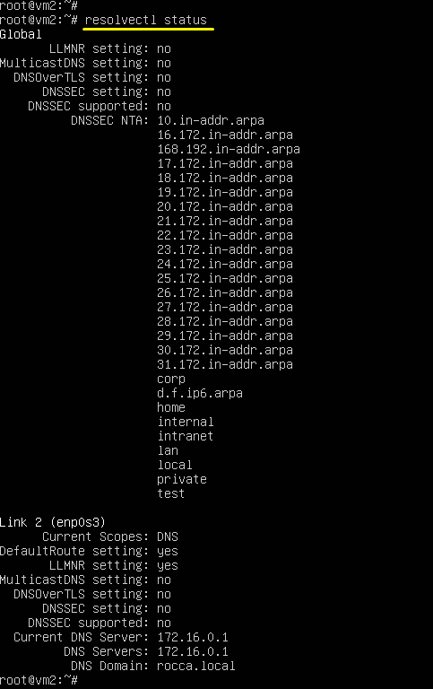  
 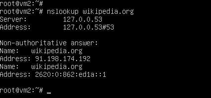  
 - **VM3:**  
 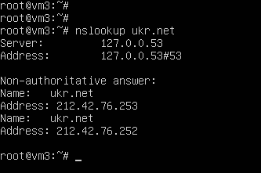  

6. * Using the scheme which follows, configure dynamic routing using OSPF protocol:  
 - Quagga installed, enabled. Ospfd enabled, all other services (protocols bgpd, ripd, isisd etc.) disabled.

Used sources:
1. https://admin812.ru/ustanovka-i-nastroyka-servera-isc-dhcp-v-ubuntu-debian.html
2. https://mnorin.com/nastrojka-dnsmasq-dhcp-dns.html
3. https://ixnfo.com/ustanovka-quagga-v-ubuntu-server-18.html
4. https://ixnfo.com/nastrojka-ospf-v-quagga.html
