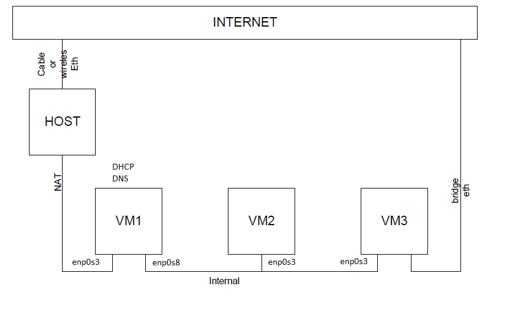

# Task 6.2 Configuring DHCP, DNS servers and dynamic routing using OSPF protocol  

  1. Testing virtual network was configured as shown on the figure 1:  
    
  VM1 has NAT and internal network connections, VM2 and VM3 – internal only interfaces.

  2. Installation and configuration of DHCP server on VM1.
   - Using VBoxManage, DNSMASQ and ISC-DHSPSERVER). You should use at least 2 of them.
3. Check VM2 and VM3 for obtaining network addresses from DHCP server.
4. Using existed network for three VMs (from p.1) install and configure DNS server on VM1. (You can
use DNSMASQ, BIND9 or something else).
5. Check VM2 and VM3 for gaining access to DNS server (naming services).
6. * Using the scheme which follows, configure dynamic routing using OSPF protocol.
