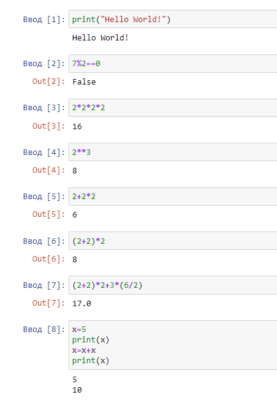
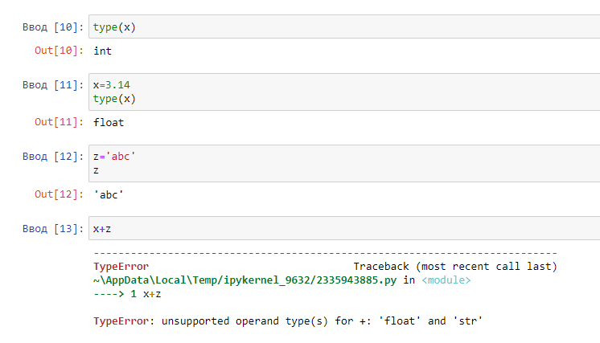
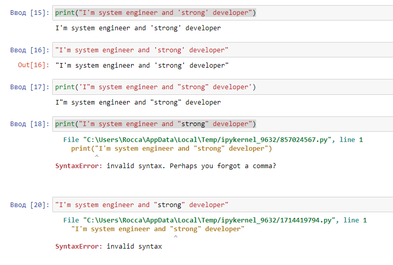
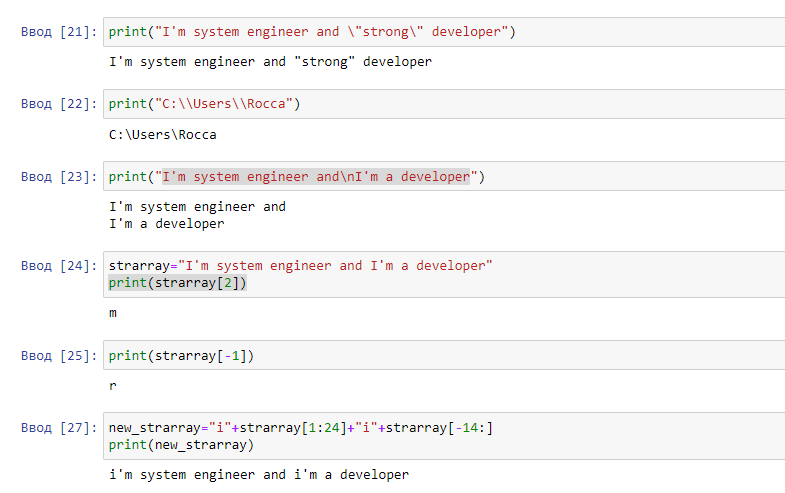
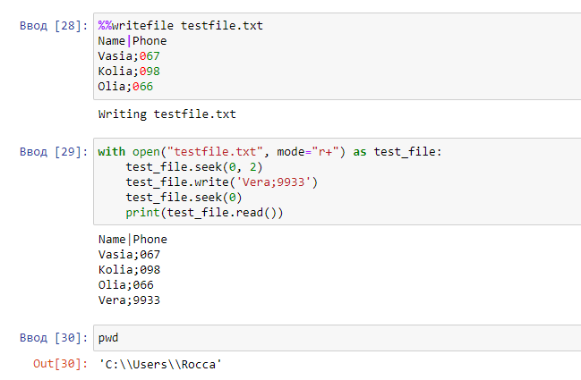
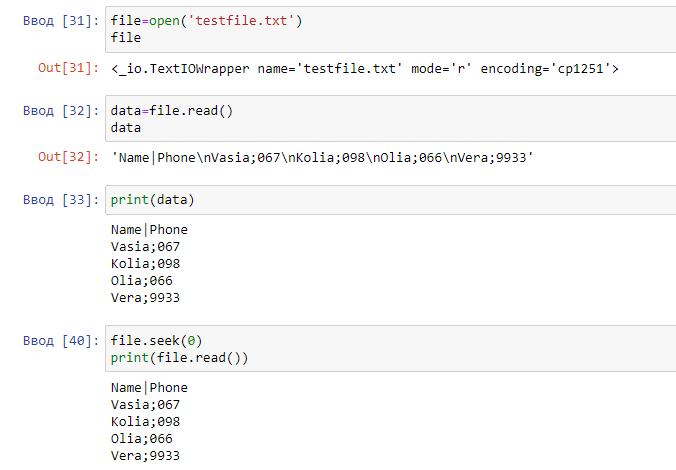
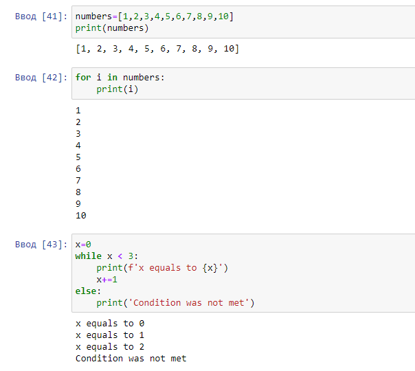
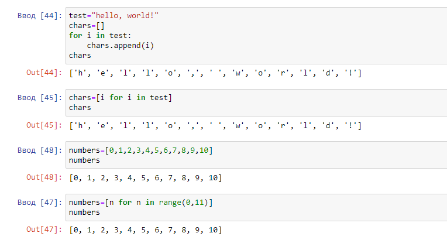

# Task 8.1  Python

1. Python 3.10.1 and Jupyter Notebooks were installed.  
2. Practice in Jupyter Notebooks (testing **.ipynb**-file (Notebook-file) can be found in [./py/](./py/)):  

**Numbers and variables examples:**  
  
  

**String examples:**  
  
  

**Operating with files:**  
  
  
Note: Method file.seek() in Python, moves pointer in the file.  

**Loop examples:**  
  

**Operating with list examples:**  
  
