# Task 9.1 Jenkins  

## 1. Simple Jenkins job (lecture 1):  
Practice of simple job creation in Jenkins:  
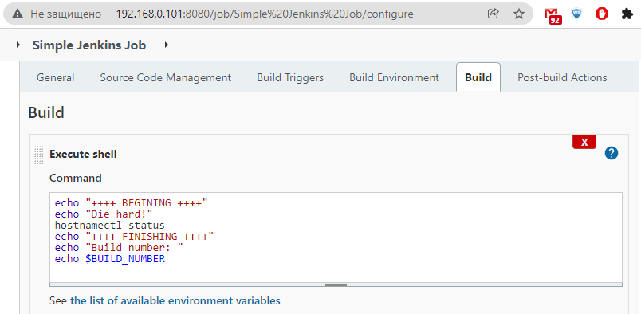  
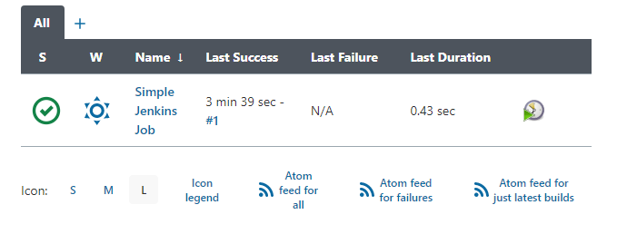  
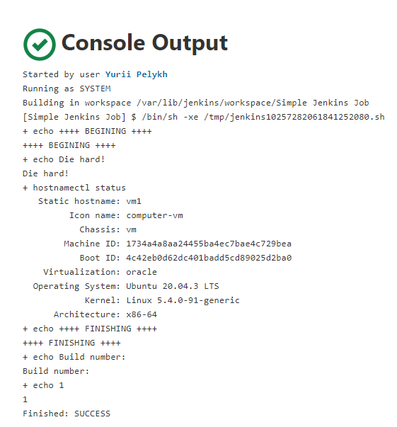  

##2. Deploy with Jenkins (lecture 2):   
### Case of "manual" deploy:  
1. Simple job with output to the local file:  
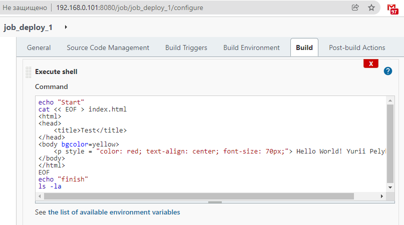  
2. Result:  
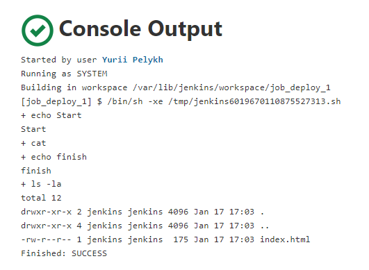  
3. Key generation:  
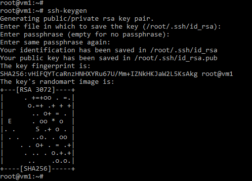  
4. Test of connection to other machine:  
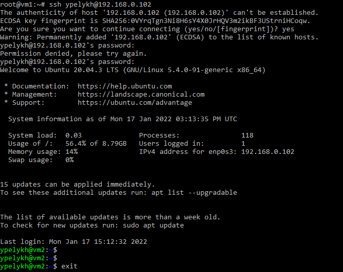  
5. Public key copied:  
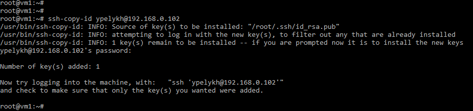  
6. Setting folder rights on remote machine VM2:  
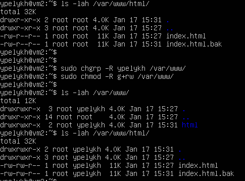  
7.**id_rsa** key should be copied to the Jenkins' directory with a correct ownership:  
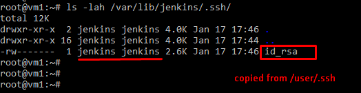  
8. Deployment task added to the job in Jenkins:  
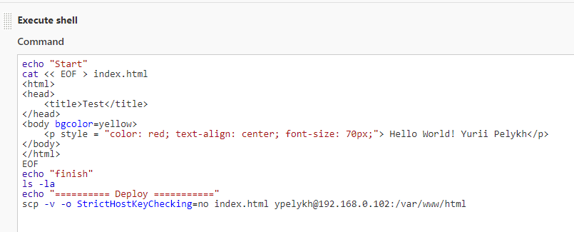  
9. Result of deploy:  
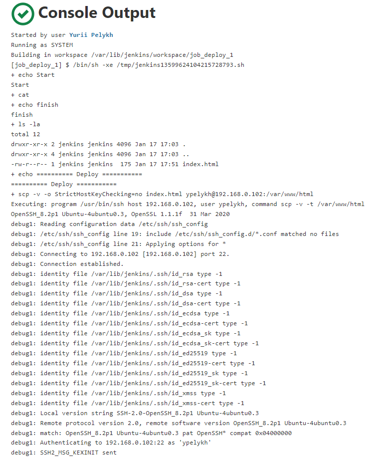  
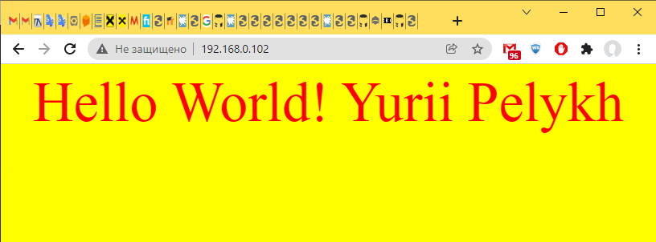  

### Pipeline Git-Jenkins-Deployment Server:  
1. Key-pair generated on a Jenkins' machine:  
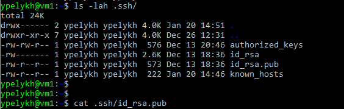  
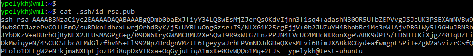  
2. GitHub key configuration:  
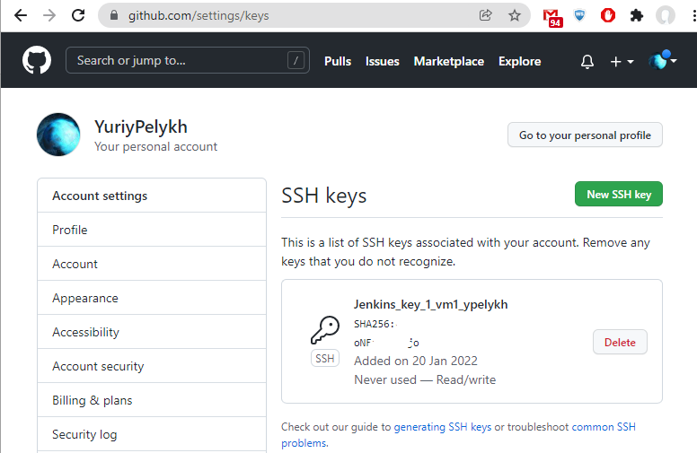  
Connection test:  
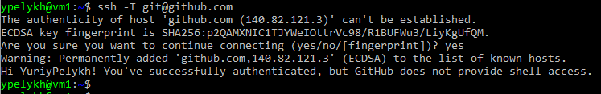  
3. Source Code Management configuration in Jenkins job:  
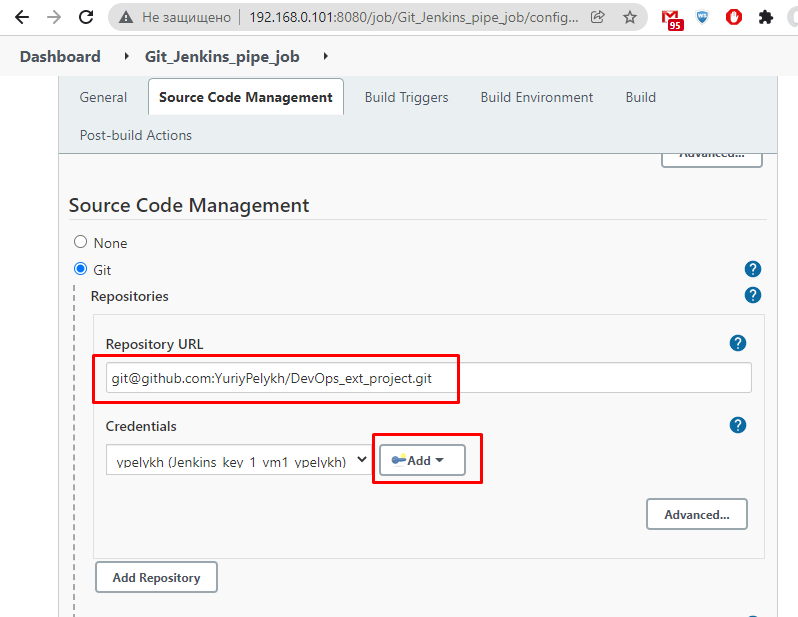  
Adding of credentials:  
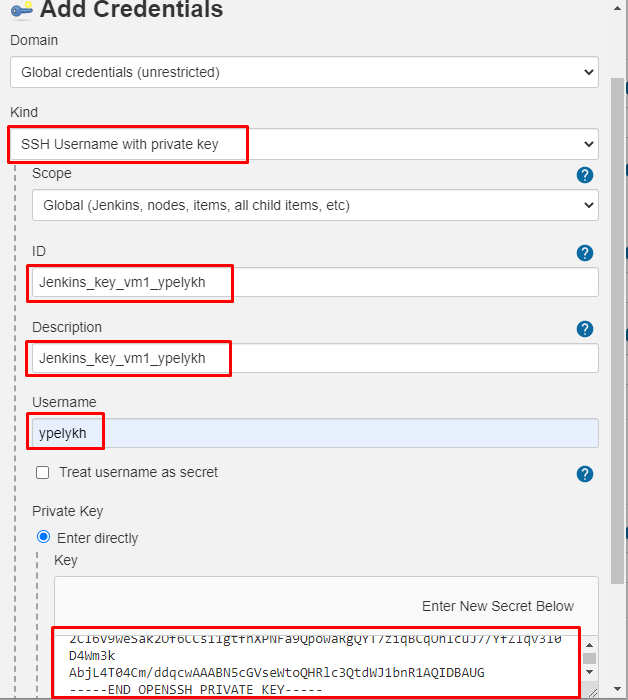  
4. Adding Build Triggers for job:  
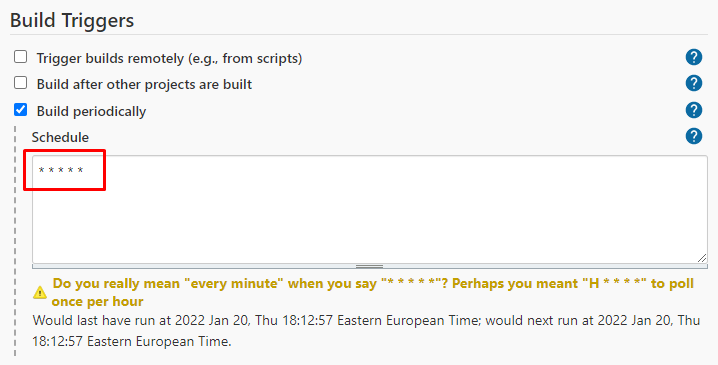  
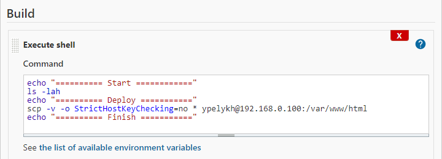  
5. While no commits were pushed to GitHub we got an error:  
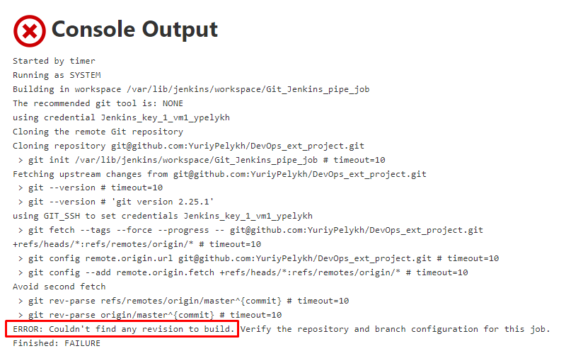  
6. Index-file was created and pushed to the Git:  
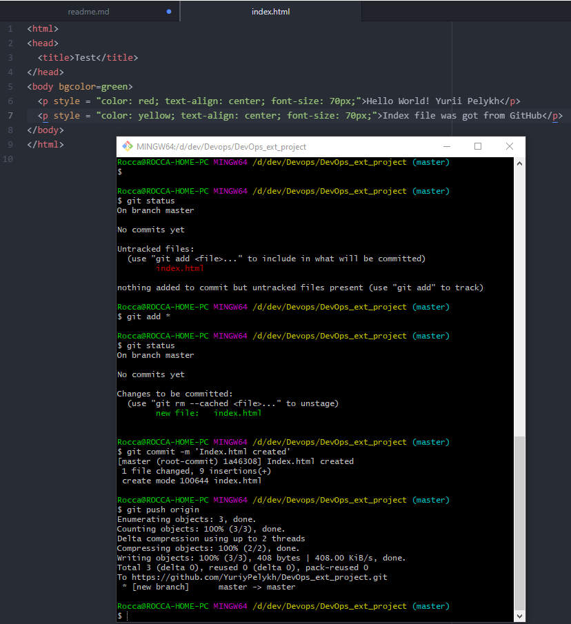  
7. Now builds run normally:  
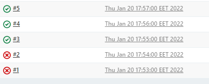  
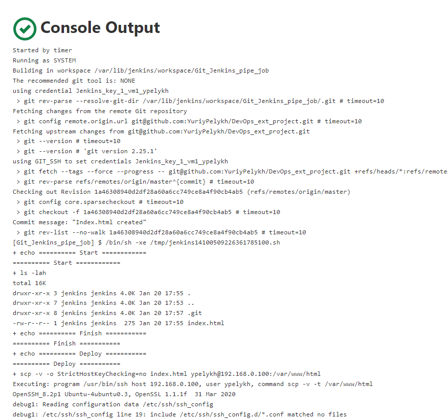  
8. Refreshed page on deploy server now looks like:  
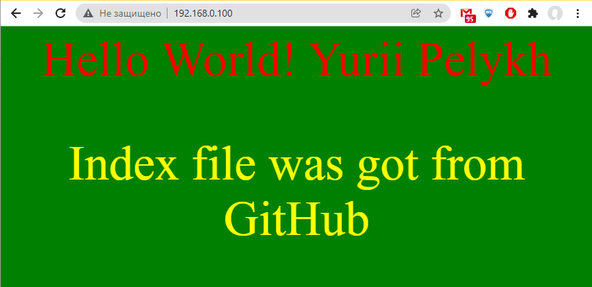  
